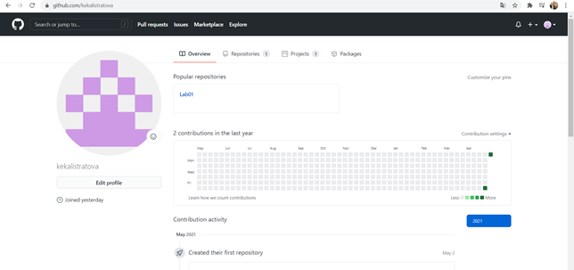
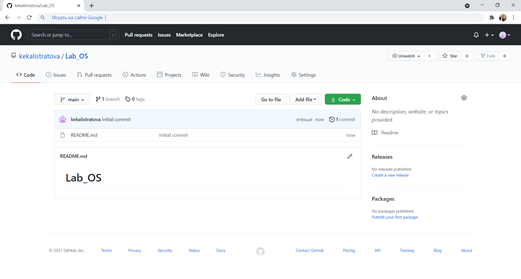
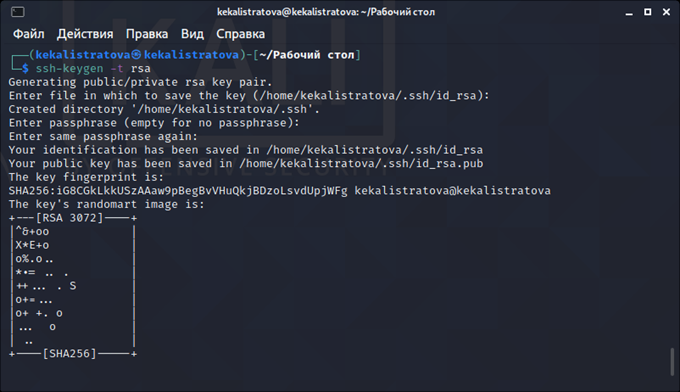
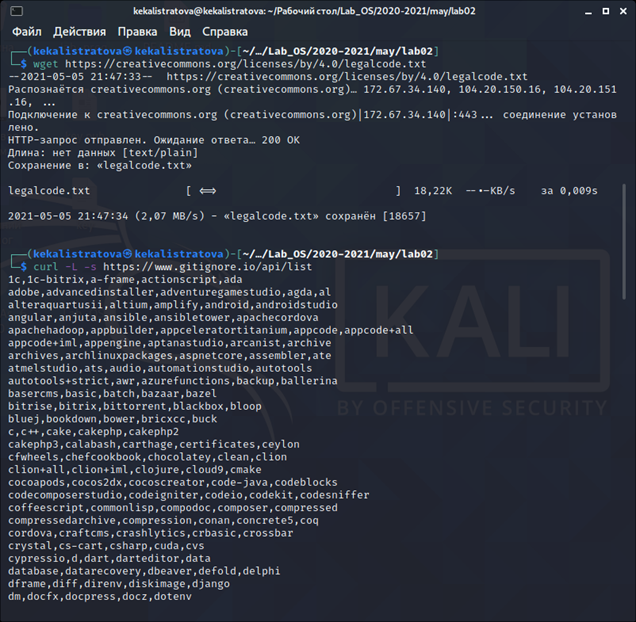
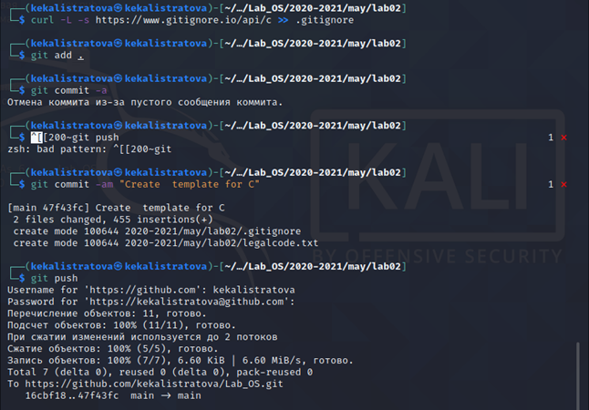
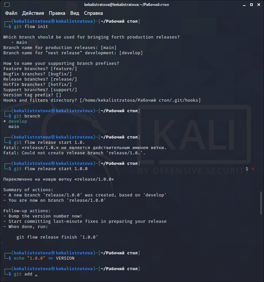

---
# Front matter
lang: ru-RU
title: "Отчёт по лабораторной работе №3"
subtitle: "Управление версиями"
author: "Калистратова Ксения Евгеньевна"

# Formatting
toc-title: "Содержание"
toc: true # Table of contents
toc_depth: 2
lof: true # List of figures
;lot: true # List of tables
fontsize: 12pt
linestretch: 1.5
papersize: a4paper
documentclass: scrreprt
polyglossia-lang: russian
polyglossia-otherlangs: english
mainfont: PT Serif
romanfont: PT Serif
sansfont: PT Sans
monofont: PT Mono
mainfontoptions: Ligatures=TeX
romanfontoptions: Ligatures=TeX
sansfontoptions: Ligatures=TeX,Scale=MatchLowercase
monofontoptions: Scale=MatchLowercase
indent: true
pdf-engine: lualatex
header-includes:
  - \linepenalty=10 # the penalty added to the badness of each line within a paragraph (no associated penalty node) Increasing the value makes tex try to have fewer lines in the paragraph.
  - \interlinepenalty=0 # value of the penalty (node) added after each line of a paragraph.
  - \hyphenpenalty=50 # the penalty for line breaking at an automatically inserted hyphen
  - \exhyphenpenalty=50 # the penalty for line breaking at an explicit hyphen
  - \binoppenalty=700 # the penalty for breaking a line at a binary operator
  - \relpenalty=500 # the penalty for breaking a line at a relation
  - \clubpenalty=150 # extra penalty for breaking after first line of a paragraph
  - \widowpenalty=150 # extra penalty for breaking before last line of a paragraph
  - \displaywidowpenalty=50 # extra penalty for breaking before last line before a display math
  - \brokenpenalty=100 # extra penalty for page breaking after a hyphenated line
  - \predisplaypenalty=10000 # penalty for breaking before a display
  - \postdisplaypenalty=0 # penalty for breaking after a display
  - \floatingpenalty = 20000 # penalty for splitting an insertion (can only be split footnote in standard LaTeX)
  - \raggedbottom # or \flushbottom
  - \usepackage{float} # keep figures where there are in the text
  - \floatplacement{figure}{H} # keep figures where there are in the text
---

# Цель работы

Целью данной работы является изучение идеологии и применения средств контроля версий.

# Задание

1. Создать учетную запись на github.com.

2. Настроить репозиторий и организовать доступ по ssh.

3. Изучить механизм управления версиями. 

# Выполнение лабораторной работы

1. Создаем учетную запись на github.com и репозиторий.

2. Инициализируем локальный репозиторий и создаю в нем файл README.md.

{ #fig:002 width=70% }

3. Создаем SSH-ключ и прописываем его в настройках на github.com.

{ #fig:003 width=70% }

4. Загружаем файлы лицензионного соглашения и gitignore. Отправляем все файлы в сетевой репозиторий.

{ #fig:005 width=70% }

{ #fig:006 width=70% }

5. Использование системы управления версиями. Создаем ветку, начинаем и завершаем в ней релиз.

{ #fig:007 width=70% }

{ #fig:008 width=70% }

6. Выполним объединение веток.

{ #fig:009 width=70% }

# Выводы

Мы приобрели практические навыки работы с системой контроля версий git и создали свой репозиторий.

# Ответы на контрольные вопросы

1. Система контроля версий Git представляет собой набор программ командной строки. Доступ к ним можно получить из терминала посредством ввода команды git с различными опциями. Системы контроля версий (Version Control System,VCS)применяются при работе нескольких человек над одним проектом.

2. В классических системах контроля версий используется централизованная модель, предполагающая наличие единого репозитория для хранения файлов. Выполнение большинства функций по управлению версиями осуществляется специальным сервером. Участник проекта (пользователь) перед началом работы посредством определённых команд получает нужную ему версию файлов. После внесения изменений, пользователь размещает новую версию в хранилище. При этом предыдущие версии не удаляются из центрального хранилища и к ним можно вернуться в любой момент. Сервер может сохранять неполную версию изменённых файлов, а производить так называемую дельта-компрессию—сохранять только изменения между последовательными версиями,что позволяет уменьшить объём хранимых данных.

Системы контроля версий также могут обеспечивать дополнительные, более гибкие функциональные возможности. Например,они могут поддерживать работу с несколькими версиями одного файла,сохраняя общую историю изменений до точки ветвления версий и собственные истории изменений каждой ветви. Кроме того, обычно доступна информация о том, кто из участников, когда и какие изменения вносил. Обычно такого рода информация хранится в журнале изменений, доступ к которому можно ограничить.

3. Централизованные системы — это системы, которые используют архитектуру клиент / сервер, где один или несколько клиентских узлов напрямую подключены к центральному серверу. Пример - Wikipedia.

В децентрализованных системах каждый узел принимает свое собственное решение. Конечное поведение системы является совокупностью решений отдельных узлов. Пример — Bitcoin.

В классических системах контроля версий используется централизованная модель, предполагающая наличие единого репозитория для хранения файлов. Выполнение большинства функций по управлению версиями осуществляется специальным сервером.

4. Создадим локальный репозиторий. Сначала сделаем предварительную конфигурацию, указав имя и email владельца репозитория:

git config --global user.name"Имя Фамилия" git config --global user.email"work@mail"

и настроив utf-8 в выводе сообщений git:

git config --global quotepath false

Для инициализации локального репозитория, расположенного, например, в каталоге ~/tutorial, необходимо ввести в командной строке:

cd

mkdir tutorial

cd tutorial

git init

5. Для последующей идентификации пользователя на сервере репозиториев необходимо сгенерировать пару ключей (приватный и открытый):

ssh-keygen -C"Имя Фамилия <work@mail>"

Ключи сохраняться в каталоге~/.ssh/.

Скопировав из локальной консоли ключ в буфер обмена

cat ~/.ssh/id_rsa.pub | xclip -sel clip

вставляем ключ в появившееся на сайте поле.

6. У Git две основных задачи: первая — хранить информацию о всех изменениях в вашем коде, начиная с самой первой строчки, а вторая — обеспечение удобства командной работы над кодом.

7. Основные команды git:

Наиболее часто используемые команды git: – создание основного дерева репозитория:git init–получение обновлений (изменений)текущего дерева из центрального репозитория:git pull–отправка всех произведённых изменений локального дерева в центральный репозиторий: git push – просмотр списка изменённых файлов в текущей директории: git status–просмотр текущих изменения: git diff– сохранение текущих изменений:–добавить все изменённые и/или созданные файлы и/или каталоги:git add .–добавить конкретные изменённые и/или созданные файлы и/или каталоги:git add имена_файлов – удалить файл и/или каталог из индекса репозитория (при этом файл и/или каталог остаётся в локальной директории): git rm имена_файлов – сохранение добавленных изменений: – сохранить все добавленные изменения и все изменённые файлы: git commit -am 'Описание коммита'–сохранить добавленные изменения с внесением комментария через встроенный редактор:git commit–создание новой ветки, базирующейся натекущей: git checkout -b имя_ветки–переключение на некоторую ветку: git checkout имя_ветки (при переключении на ветку, которой ещё нет в локальном репозитории, она будет создана и связана с удалённой) – отправка изменений конкретной ветки в центральный репозиторий: git push origin имя_ветки–слияние ветки стекущим деревом:git merge --no-ff имя_ветки–удаление ветки: – удаление локальной уже слитой с основным деревом ветки:git branch -d имя_ветки–принудительное удаление локальной ветки:git branch -D имя_ветки–удаление ветки с центрального репозитория: git push origin :имя_ветки

8. Использования git при работе с локальными репозиториями (добавления текстового документа в локальный репозиторий):

git add hello.txt

git commit -am' Новый файл

9. Проблемы, которые решают ветки git:

- нужно постоянно создавать архивы с рабочим кодом

- сложно "переключаться" между архивами

- сложно перетаскивать изменения между архивами

- легко что-то напутать или потерять

10. Во время работы над проектом так или иначе могут создаваться файлы, которые не требуется добавлять в последствии в репозиторий. Например, временные файлы, создаваемые редакторами,или объектные файлы, создаваемые компиляторами. Можно прописать шаблоны игнорируемых при добавлении в репозиторий типов файлов в файл.gitignore с помощью сервисов. Для этого сначала нужно получить список имеющихся шаблонов: curl -L -s https://www.gitignore.io/api/list

Затем скачать шаблон,например, для C и C++

curl -L -s https://www.gitignore.io/api/c >> .gitignore

curl -L -s https://www.gitignore.io/api/c++ >> .gitignore
