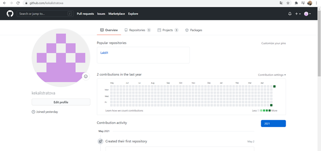
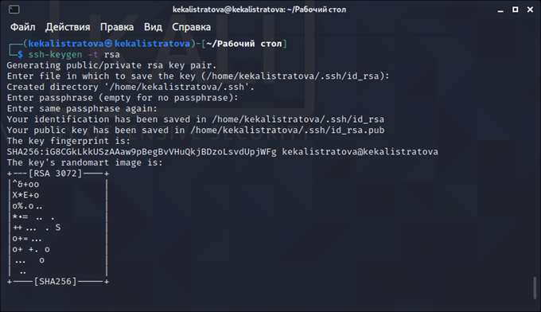
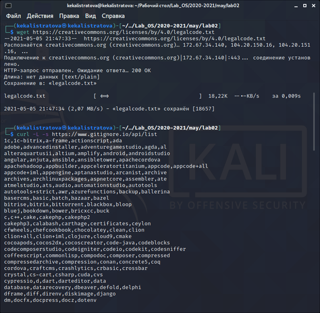
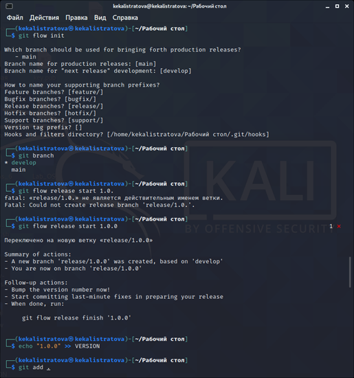
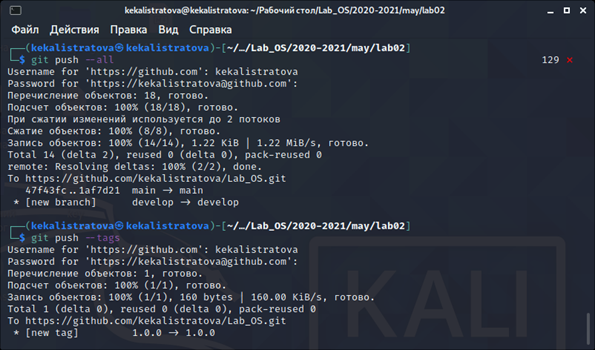

---
## Front matter
lang: ru-RU
title: Лабораторная работа №3
author: |
	Калистратова Ксения Евгеньевна НПМбд-02-20\inst{1}
institute: |
	\inst{1}RUDN University, Moscow, Russian Federation
date: 29 апреля, 2021, Москва, Россия

## Formatting
toc: false
slide_level: 2
theme: metropolis
header-includes: 
 - \metroset{progressbar=frametitle,sectionpage=progressbar,numbering=fraction}
 - '\makeatletter'
 - '\beamer@ignorenonframefalse'
 - '\makeatother'
aspectratio: 43
section-titles: true
---

# Цель работы

Научиться оформлять отчёты с помощью легковесного языка разметки Markdown.

# Задание

Сделайте отчёт по предыдущей лабораторной работе в формате Markdown.
В качестве отчёта просьба предоставить отчёты в 3 форматах:pdf,docxиmd(вархиве,поскольку он должен содержать скриншоты,Makefile ит.д.)

# Выполнение лабораторной работы

Создаем учетную запись на https://github.com.

Настраиваем систему контроля версий git. Синхранизируем учётную запись github с компьютером.

После этого создаём новый ключ на github и привязываем его к копьютеру через консоль.

Следующим шагом будет создание и подключение репозитория к github. В gethup заходим в «repository» и создаём новый репозиторий (имя «laboratory», а заголовок для файла README). Копируем в консоль ссылку на репозиторий (для дальнейшей работы с файлами).

В лабораторной работе описан логаритм создания структуры католога через консоль. Но легче будет создать репозиторий в gethup и после этого работать с каталогом и папками через консоль (перед этим необходимо скопировать ссылку на репозиторий в консоль, в формате https или ssh).  Перед тем, как создавать файлы, заходим в наш репозиорий:

После этого можем уже создавать наши файлы.

Добавляем первый коммит и выкладываем на gethup. Для того, чтобы правильно разместить первый коммит, необходимо добавить команду git add ., после этого с помощью команды git commit -m "first commit" выкладываем коммит.

Сохраняем первый коммит, используя команду git push.

Первичная конфигурация: 

1. Добавляем файл лицензии.

2. Добавим шаблон игнорируемых файлов. Просмотрим список имеющихся шаблонов (на скриншоте список шаблонов представлен не в целом виде).

3. Скачиваем шаблон, например, для C. Также добавляем новые файлы и выполняем коммит.

 

4. Отправим на github (для этого сохраним все созданные шаблоны и файлы, используя команду git push).

.

2. Проверяем, что мы находимся на ветке develop (используем команду git branch).

3. Создаём релиз с версией 1.0.0.

4. Запишем версию и добавим в индекс.

5. Заливаем релизную ветку в основную ветку (используем команду git flow release finish1.0.0).

6. Отправляем данные на github.

Создаем релиз на github. Для этого заходим в «Releases», нажимаем «Создать новый релиз». Заходим в теги и заполняем все поля (создаём теги для версии 1.0.0). После создания тега, автоматически сформируется релиз.

# Выводы

Я изучила идеологию и научилась применять средства контроля версий. 
