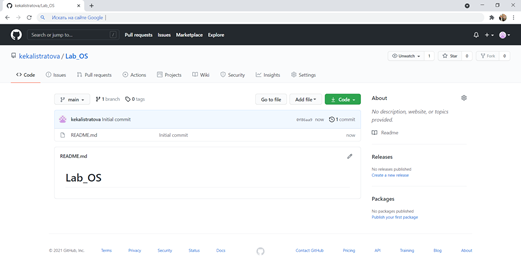
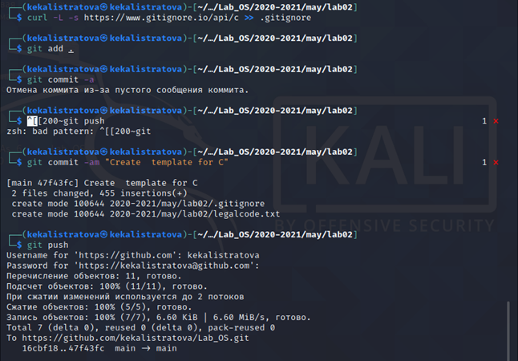

---
## Front matter
lang: ru-RU
title: Лабораторная работа №3
author: |
	Калистратова Ксения Евгеньевна НПМбд-02-20\inst{1}
institute: |
	\inst{1}RUDN University, Moscow, Russian Federation
date: 29 апреля, 2021, Москва, Россия

## Formatting
toc: false
slide_level: 2
theme: metropolis
header-includes: 
 - \metroset{progressbar=frametitle,sectionpage=progressbar,numbering=fraction}
 - '\makeatletter'
 - '\beamer@ignorenonframefalse'
 - '\makeatother'
aspectratio: 43
section-titles: true
---

# Цель работы

Научиться оформлять отчёты с помощью легковесного языка разметки Markdown.

# Задание

Сделайте отчёт по предыдущей лабораторной работе в формате Markdown.
В качестве отчёта просьба предоставить отчёты в 3 форматах:pdf,docxиmd(вархиве,поскольку он должен содержать скриншоты,Makefile ит.д.)

# Выполнение лабораторной работы

1. Создаем учетную запись на github.com и репозиторий.

2. Инициализируем локальный репозиторий и создаю в нем файл README.md.

3. Создаем SSH-ключ и прописываем его в настройках на github.com.

4. Загружаем файлы лицензионного соглашения и gitignore. Отправляем все файлы в сетевой репозиторий.

5. Использование системы управления версиями. Создаем ветку, начинаем и завершаем в ней релиз.

6. Выполним объединение веток.

# Выводы

Я изучила идеологию и научилась применять средства контроля версий. 
