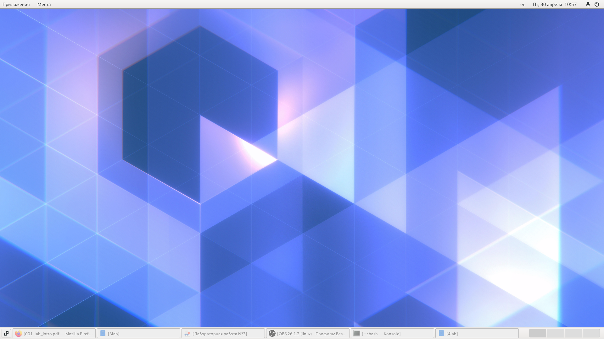

---
## Front matter
lang: ru-RU
title: Лабораторная работа №4
author: |
	Калистратова Ксения Евгеньевна\inst{1}
institute: |
	\inst{1}RUDN University, Moscow, Russian Federation
date: 30 апреля, 2021, Москва, Россия

## Formatting
toc: false
slide_level: 2
theme: metropolis
header-includes: 
 - \metroset{progressbar=frametitle,sectionpage=progressbar,numbering=fraction}
 - '\makeatletter'
 - '\beamer@ignorenonframefalse'
 - '\makeatother'
aspectratio: 43
section-titles: true
---

## Цель работы

Познакомиться с операционной системой Linux, получить практические навыки работы с консолью и некоторыми графическими менеджерами рабочих столов операционной системы.

## Выполнение лабораторной работы

Работаем с текстовой и графической консолью. Изучаем переходы в консоли и между ними. 

## Выполнение лабораторной работы

Знакомимся с менеджерами рабочих столов.(рис. -@fig:001)

## Выполнение лабораторной работы

Изучаем список установленных программ.(рис. -@fig:005)

## Вывод

В ходе этой лабораторной работы я познакомилась с операционной системой Linux, получила практические навыки работы с консолью и некоторыми графическими менеджерами рабочих столов операционной системы.