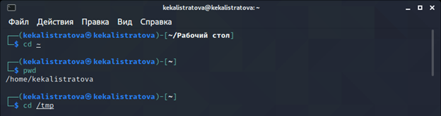
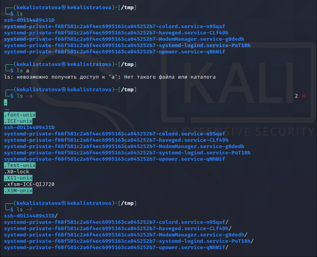
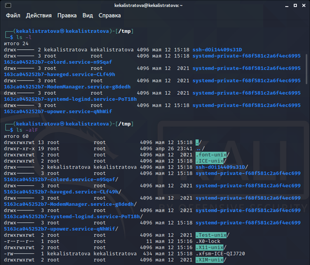
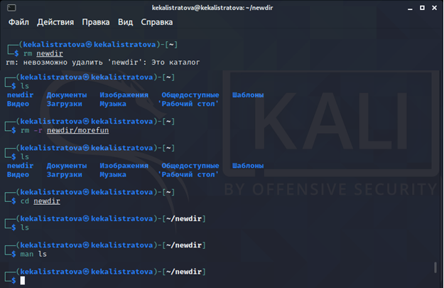
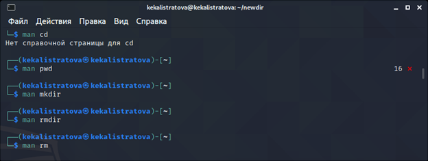

## Цель работы

Приобретение  практических  навыков  взаимодействия пользователя с системой посредством командной строки.

## Задачи

1. Изучить команды man, cd, pwd, ls, mkdir, rm, history.
2. В ходе работы использовать эти команды и интерпретировать их вывод.
3. Сделать отчет.

## Выполнение лабораторной работы

Переходим в каталог /tmp и выводим на экран его содержимое. Для этого используйте команду ls с различными опциями. (Рисунки 1-3)

Переходим в домашний каталог и выводим его содержимое.

## Выполнение лабораторной работы

В домашнем каталоге создадим новый каталог с именем newdir, а внутри него каталог morefun. Изучим команды удаления. 

Создаем три новых каталога и затем удаляем их. (Рисунки 4-5)

## Выполнение лабораторной работы

С помощью команды man определяем набор опций команд.(Рисунок 6)

Используя информацию, полученную при помощи команды history, выполните модификацию и исполнение нескольких команд из буфера команд.

## Вывод

В  ходе  выполнения  данной  лабораторной  работы  я  приобрела практические навыки взаимодействия с системой посредством командной строки.
