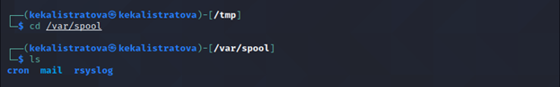
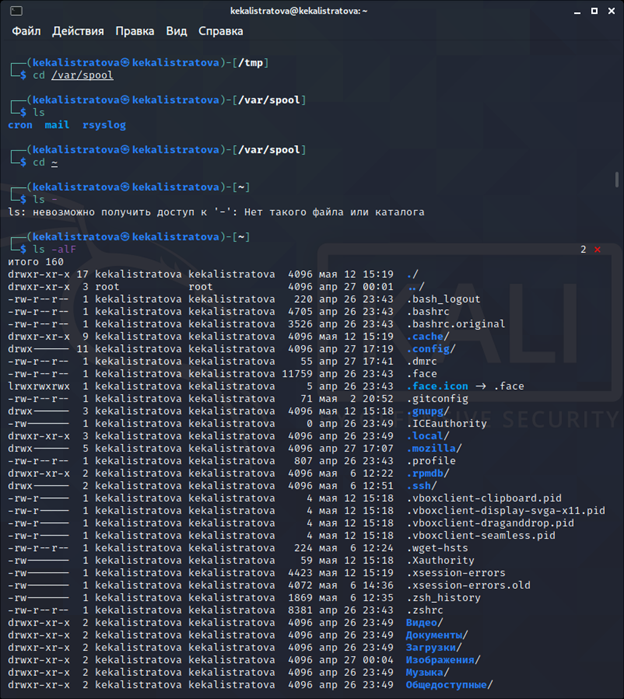

---
# Front matter
lang: ru-RU
title: "Отчет по лабораторной работе №6"
subtitle: "Дисциплина: Операционные системы"
author: "Калистратова Ксения Евгеньевна"

# Formatting
toc-title: "Содержание"
toc: true # Table of contents
toc_depth: 2
lof: true # List of figures
fontsize: 12pt
linestretch: 1.5
papersize: a4paper
documentclass: scrreprt
polyglossia-lang: russian
polyglossia-otherlangs: english
mainfont: PT Serif
romanfont: PT Serif
sansfont: PT Sans
monofont: PT Mono
mainfontoptions: Ligatures=TeX
romanfontoptions: Ligatures=TeX
sansfontoptions: Ligatures=TeX,Scale=MatchLowercase
monofontoptions: Scale=MatchLowercase
indent: true
pdf-engine: lualatex
header-includes:
  - \linepenalty=10 # the penalty added to the badness of each line within a paragraph (no associated penalty node) Increasing the value makes tex try to have fewer lines in the paragraph.
  - \interlinepenalty=0 # value of the penalty (node) added after each line of a paragraph.
  - \hyphenpenalty=50 # the penalty for line breaking at an automatically inserted hyphen
  - \exhyphenpenalty=50 # the penalty for line breaking at an explicit hyphen
  - \binoppenalty=700 # the penalty for breaking a line at a binary operator
  - \relpenalty=500 # the penalty for breaking a line at a relation
  - \clubpenalty=150 # extra penalty for breaking after first line of a paragraph
  - \widowpenalty=150 # extra penalty for breaking before last line of a paragraph
  - \displaywidowpenalty=50 # extra penalty for breaking before last line before a display math
  - \brokenpenalty=100 # extra penalty for page breaking after a hyphenated line
  - \predisplaypenalty=10000 # penalty for breaking before a display
  - \postdisplaypenalty=0 # penalty for breaking after a display
  - \floatingpenalty = 20000 # penalty for splitting an insertion (can only be split footnote in standard LaTeX)
  - \raggedbottom # or \flushbottom
  - \usepackage{float} # keep figures where there are in the text
  - \floatplacement{figure}{H} # keep figures where there are in the text
---

# Цель работы

Приобретение практических навыков взаимодействия пользователя с системой посредством командной строки. 

# Задачи

1. Изучить команды man, cd, pwd, ls, mkdir, rm, history.
2. В ходе работы использовать эти команды и интерпретировать их вывод.
3. Сделать отчет.

# Выполнение лабораторной работы

1) Определяем  полное  имя  домашнего  каталога,  используя  команду «pwd»,  т.к. уже  находимся  в  домашнем  каталоге (обозначается: ~). Если бы мы не находились в нем, необходимо было бы  предварительно  использовать  команду  «cd~»,  чтобы  перейти  в него. (рис. -@fig:001)

{ #fig:001 width=70% }

2.1) Переходим в каталог /tmp, используякоманду «cd/tmp» (рис. -@fig:002)

{ #fig:002 width=70% }

2.2) Выводим на экран содержимое каталога /tmp, используя команду «ls» с различными опциями(рис. -@fig:003):

1) «ls»− выводится  список каталогов  и  файлов,  которые  можно увидеть, «вручную»открыв каталог tmp

2) «ls -a»− к  списку,  описанному  в  предыдущем  пункте, добавляются скрытые каталоги и файлы(их имена начинаются с точки)

3) «ls -F»−с  помощью  этой  команды  получаеминформацию  о типах файлов

4) «ls -l» −получаем список каталогов и файлов, но  уже с  более подробной информацией о них

5) «ls -alF»−данная  команда  отобразит  список  всех  каталогов  и файлов, в том числе и скрытых, с подробной информацией о них.

{ #fig:003 width=70% }

2.3) Чтобы  определить,  есть  ли  в  каталоге  /var/spool подкаталог  с именем cron, перейдем в указанный каталог с помощью команды «cd /var/spool»,  просмотрим  его  содержимое,  используя  команду  «ls», и, таким образом, убедимся, что данный подкаталог существует (рис. -@fig:004).

{ #fig:004 width=70% }

2.4) Далее  перехожу  в  свой  домашний  каталог  с  помощью  команды «cd ~»и,  используя  команду  «ls -alF»,  вывожу  на  экран  его содержимое. Видно, что владельцем всех каталогов и файлов, кроме родительского каталога (его владелец пользователь root из  группы  пользователей root),является  пользователь eepermyakova из группы пользователей studsci.(рис. -@fig:005)

{ #fig:005 width=70% }

3.1) В  домашнем  каталоге  создаем  новый  каталог newdir,  используя команду «mkdir newdir». Убеждаемся, что каталог создан, с помощью команды «ls».(рис. -@fig:006)

{ #fig:006 width=70% }

3.2) Командой «cd newdir» переходим в ранее созданный каталог и там создаем каталог morefun, используя команду «mkdir morefun». Командой «ls» проверяем правильность выполненных действий.(рис. -@fig:007)

{ #fig:007 width=70% }

3.3) Используя  команду  «mkdir letters memos misk», создаем  в домашнем  каталоге  три  новых.  Далее  с  помощью  команды  «rm –r letters memos misk» удаляем  созданные  каталоги. Командой «ls» проверяем правильность выполненных действий.(рис. -@fig:008)

{ #fig:008 width=70% }

3.4) Пробуем удалить каталог newdir командой «rm newdir». Получаем отказ  в  выполнении  команды  (т.к.  данный  каталог  содержит подкаталог morefun и требуется при удалении использовать опцию -r).

3.5) Удаляем  каталог newdir/morefun,  используякоманду  «rm –r newdir/morefun».Командой    «ls» проверяем правильность выполненного действия.(рис. -@fig:009)

{ #fig:009 width=70% }

4) Используя  команду  «man ls»,  определяю,  какую  опцию  команды ls необходимо  использовать,  чтобы  просмотреть  содержимое  не  только указанного каталога, но и подкаталогов, входящих в него. (рис. -@fig:010)(рис. -@fig:011)

{ #fig:010 width=70% }

{ #fig:011 width=70% }

5) Используя то же руководство по команде «ls», открытое в предыдущем пункте,   определяю   набор   опций   команды ls,   позволяющий отсортировать  по  времени  последнего  изменения  выводимый  список содержимого каталога с развернутым описанием файлов.(рис. -@fig:012)(рис. -@fig:013)(рис. -@fig:014)

{ #fig:012 width=70% }

{ #fig:013 width=70% }

{ #fig:014 width=70% }

6) Используя команды «man cd», «man pwd», «man mkdir», «man rmdir», «man rm», просматриваюописание соответствующих команд.(рис. -@fig:015)

{ #fig:015 width=70% }

Команда cd не имеет дополнительных опций (рис. -@fig:016):

{ #fig:016 width=70% }

Команда pwd(рис. -@fig:017):

1) -L, --logical не разыменовывать символические ссылки. Если путь содержит символические  ссылки,  то  выводить  их  безпреобразования  в исходный путь;

2) -P, --physical преобразовывать(отбрасывать    символические    ссылки)символические ссылки в исходные имена. Если путь содержит символические ссылки, то они будут преобразованы в названия исходных директорий, на которые они указывают;

3) --help показать справку по команде pwd;

4) --version показать версию утилиты pwd.

{ #fig:017 width=70% }

Команда mkdir(рис. -@fig:018):

1) -m,--mode=MODE устанавливает  права  доступа  для  создаваемой  директории. Синтаксис MODE такой же как у команды chmod;

2) -p,--parents создать  все  директории,  которые  указаны  внутри  пути.  Если какая-либо директория существует, то предупреждение об этом не выводится;

3) -v, --verbose выводить сообщение о каждой создаваемой директории;

4) -z установить  контекст  SELinux  для  создаваемой  директории  по умолчанию;

5) --context[=CTX] установить  контекст  SELinux  для  создаваемой  директории  в значение CTX;

6) --help показать справку по команде mkdir;

7) --versionпоказать версию утилиты mkdir.

{ #fig:018 width=70% }

Команда rmdir (рис. -@fig:019):

1) --ignore-fail-on-non-empty игнорировать директории, которые содержат в себе файлы;

2) -p, --parents в  этой  опции  каждый  аргумент  каталога  обрабатывается  как путь, из которого будут удалены все компоненты, если они уже пусты, начиная с последнего компонента;

3) -v, --verbose отображение    подробной    информациидля    каждого обрабатываемого каталога;

4) --help показать справку по команде rmdir;

5) --version показать версию утилиты rmdir.

{ #fig:019 width=70% }

Команда rm (рис. -@fig:020) (рис. -@fig:021):

1) -f, --force игнорировать несуществующие файлы и аргументы. Никогда не выдавать запросы на подтверждение удаления;

2) -i выводить запрос на подтверждение удаления каждого файла;

3) -I выдать  один  запрос  на  подтверждение  удаления  всех  файлов, если  удаляется  больше  трех  файлов  или  используется рекурсивное   удаление. Опция применяется, как   более «щадящая» версия опции –i;

4) --interactive[=WHEN] вместо WHEN можно использовать:

never — никогда  не  выдавать  запросы  на  подтверждение удаления.

once — выводить запрос один раз (аналог опции -I).

always — выводить запрос всегда (аналог опции -i).

Если значение КОГДА не задано, то используется always;

5) --one-file-system во  время  рекурсивного  удаления  пропускать  директории, которые находятся на других файловых системах;

6) --no-preserve-root если в качестве директории для удаления задан корневой раздел /, то считать, что это обычная директория и начать выполнять удаление;

7) --preserve-root[=all] если в качестве директории для удаления задан корневой раздел /, то запретить выполнять команду rm над корневым разделом. Данное поведение используется по умолчанию;

8) -r, -R, --recursive удаление директорий и их содержимого. Рекурсивное удаление;

9) -d, --dir удалять пустые директории;

10) -v, --verbose выводитьинформацию об удаляемых файлах;

11) --help показать справку по команде rm;

12) --version показать версию утилиты rm.

{ #fig:020 width=70% }

{ #fig:021 width=70% }

7) Выведем историю команд с помощью команды «history». (рис. -@fig:022) (рис. -@fig:023) Далее,  используя  команды,  «!515:s/morefun/lessfun» и  «!516»,выполним  команды 515 и 516 (в 515 будет создан каталог lessfun вместо morefun). (рис. -@fig:024)

{ #fig:022 width=70% }

{ #fig:023 width=70% }

{ #fig:024 width=70% }

# Контрольные вопросы

1) Команднаястрока–специальная  программа, позволяющая  управлять операционной  системой  при  помощи  текстовых  команд,  вводимых  в окне приложения.

2) Для определения абсолютного пути к текущему каталогу используется команда  pwd  (print  working  directory).  Например,  команда  «pwd»  в моем домашнем каталоге выведет: afs/.dk.sci.pfu.edu.ru/home/e/e/eepermyakova

3) Команда  «ls-F» (или  «ls-aF»,  тогда  появятся  еще  скрытые  файлы) выведет имена файлов в текущем каталоге и их типы. Тип каталога обозначается /, тип исполняемого файла обозначается *, тип ссылки обозначается @.

4) Имена  скрытых  файлов  начинаются  с  точки.  Эти  файлы  в операционной системе скрыты от просмотра и обычно используются для  настройки  рабочей  среды.  Для  того,  чтобы  отобразить  имена скрытых файлов, необходимо использовать команду «ls –a».

5) Команда  rm  используется  для  удаления  файлов  и/или  каталогов. Команда rm-iвыдает  запрос  подтверждения  наудаление  файла. Команда rm-rнеобходима, чтобы удалить каталог, содержащий файлы. Без указания этой опции команда не будет выполняться. Если каталог пуст,  то  можно  воспользоваться  командой  rmdir.  Если  удаляемый каталог  содержит  файлы,  то  команда  не  будетвыполнена –нужно использовать «rm -r имя_каталога».Таким  образом,  каталог,  не  содержащий  файлов,  можно  удалить  и командой rm, и командой rmdir. Файл командой rmdirудалить нельзя.

6) Чтобы  определить,  какие  команды  выполнил  пользователь  в  сеансе работы, необходимо воспользоваться командой «history».

7) Чтобы  исправить  илизапустить  на  выполнение  команду,  которую пользователь уже использовал в сеансе работы, необходимо: в первом случае:воспользоваться конструкцией !<номер_команды>:s/<что_меняем>/<на_что_меняем>,   во   втором случае: !<номер_команды>. 

8)Чтобы записать в одной строке несколько команд, необходимо между ними поставить ; . Например, «cd /tmp; ls».

9) Символ  обратного  слэша позволяет  использовать  управляющие символы  (".",  "/",  "$",  "*",  "[",  "]",  "^",  "&")  без  их  интерпретации командной оболочкой; процедура  добавления данного  символа  перед управляющими  символами  называетсяэкранированием  символов.Например,  команда  «ls newdir\/morefun»  отобразит  содержимое каталога newdir/morefun.

10) Команда «ls -l» отображает список каталогов и файлов с подробной информацией  о  них(тип  файла,  право  доступа, число  ссылок, владелец, размер, дата последней ревизии, имя файла или каталога).

11) Полный, абсолютный путь от корня файловой системы –этот путь начинается от корня "/" и описывает весь путь к файлуили каталогу; Относительный  путь–это  путь  к файлу  относительно  текущего каталога(каталога,  где  находится  пользователь).Например, «cd/newdir/morefun»–абсолютный  путь,  «cd newdir»–относительный путь.

12) Чтобы получить необходимую информацию о команде, необходимо воспользоваться конструкцией man[имя_команды], либо использовать опцию help, которая предусмотрена для некоторых команд

13) Для автоматического дополнения вводимых команд служит клавиша Tab.

# Выводы

В ходе выполнения данной лабораторной работы я приобрела практические навыки взаимодействия с системой посредством командной строки. 

# Контрольные вопросы

1)	Командная строка – специальная программа, позволяющая управлять операционной системой при помощи текстовых команд, вводимых в окне приложения.
2)	Для определения абсолютного пути к текущему каталогу используется команда pwd (print working directory). Например, команда «pwd» в моем домашнем каталоге выведет: /home/kaleontjeva 
3)	Команда «ls -F» (или «ls -aF», тогда появятся еще скрытые файлы) выведет имена файлов в текущем каталоге и их типы.
Тип каталога обозначается /, тип исполняемого файла обозначается *, тип ссылки обозначается @. Пример на Рисунке 2. 
4)	Имена скрытых файлов начинаются с точки. Эти файлы в операционной системе скрыты от просмотра и обычно используются для настройки рабочей среды. Для того, чтобы отобразить имена скрытых файлов, необходимо использовать команду «ls –a». Пример на Рисунке 2. 
5)	Команда rm используется для удаления файлов и/или каталогов. Команда rm -i выдает запрос подтверждения на удаление файла. Команда rm -r необходима, чтобы удалить каталог, содержащий файлы. Без указания этой опции команда не будет выполняться. Если каталог пуст, то можно воспользоваться командой rmdir. Если удаляемый каталог содержит файлы, то команда не будет выполнена – нужно использовать «rm -r имя_каталога».
Таким образом, каталог, не содержащий файлов, можно удалить и командой rm, и командой rmdir. Файл командой rmdir удалить нельзя. 
Примеры на Рисунке 9. 
6)	Чтобы определить, какие команды выполнил пользователь в сеансе работы, необходимо воспользоваться командой «history». 
7)	Чтобы исправить или запустить на выполнение команду, которую пользователь уже использовал в сеансе работы, необходимо: в первом случае: воспользоваться конструкцией 
!<номер_команды>:s/<что_меняем>/<на_что_меняем>, во втором случае: !<номер_команды>. Примеры на Рисунке 23. 
8)	Чтобы записать в одной строке несколько команд, необходимо между ними поставить ; . Например, «cd /tmp; ls». 
9)	Символ обратного слэша \ позволяет использовать управляющие символы ( ".", "/", "$", "*", "[", "]", "^", "&") без их интерпретации командной оболочкой; процедура добавления данного символа перед управляющими символами называется экранированием символов. Например, команда «ls newdir\/morefun» отобразит содержимое каталога newdir/morefun. 
10)	Команда «ls -l» отображает список каталогов и файлов с подробной информацией о них (тип файла, право доступа, число ссылок, владелец, размер, дата последней ревизии, имя файла или каталога). 
11)	Полный, абсолютный путь от корня файловой системы – этот путь начинается от корня "/" и описывает весь путь к файлу или каталогу; Относительный путь – это путь к файлу относительно текущего каталога (каталога, где находится пользователь). Например, «cd /newdir/morefun» – абсолютный путь, «cd newdir» – относительный путь. 
12)	Чтобы получить необходимую информацию о команде, необходимо воспользоваться конструкцией man [имя_команды], либо использовать опцию help, которая предусмотрена для некоторых команд. 
13)	Для автоматического дополнения вводимых команд служит клавиша Tab. 
