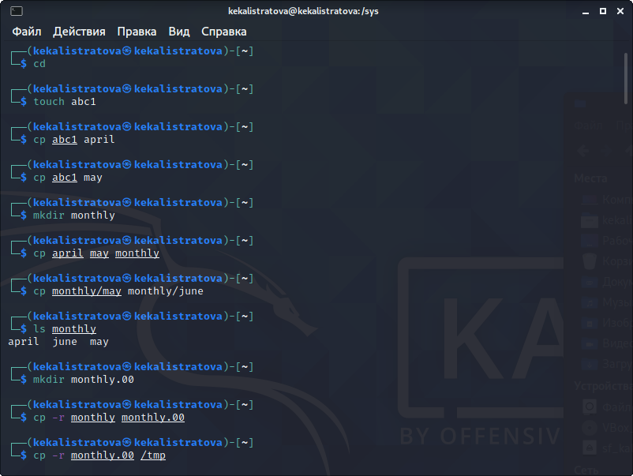
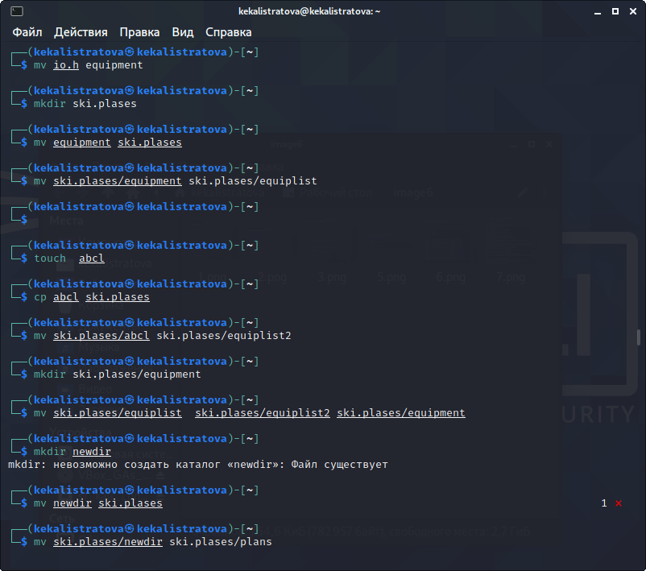
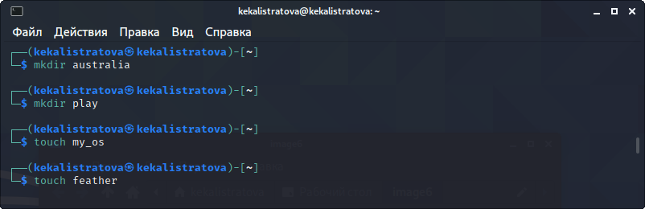
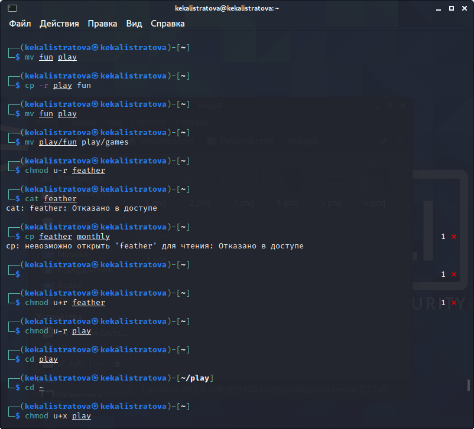

---
## Front matter
lang: ru-RU
title: Лабораторная работа №6
author: |
	Калистратова Ксения Евгеньевна\inst{1}
institute: |
	\inst{1}RUDN University, Moscow, Russian Federation
date: 14 мая, 2021, Москва, Россия

## Formatting
toc: false
slide_level: 2
theme: metropolis
header-includes: 
 - \metroset{progressbar=frametitle,sectionpage=progressbar,numbering=fraction}
 - '\makeatletter'
 - '\beamer@ignorenonframefalse'
 - '\makeatother'
aspectratio: 43
section-titles: true
---

## Цель работы

Ознакомление с файловой системой Linux, её структурой, именами и содержанием каталогов. Приобретение практических навыков по  применению  команд  для  работы  с  файлами  и  каталогами,  по управлению процессами (и работами), по проверке использования диска и обслуживанию файловой системы.

## Задачи

1. Изучить команды для работы с файлами и каталогами.
2. Изучить команды для копирования файлов и каталогов.
3. Изучить команды для перемещения и переименования файлов и каталогов.
4. Изучить права доступа файлов или каталогов.
5. В ходе работы использовать эти команды и интерпретировать их вывод.
6. Выполнить отчет.

## Выполнение лабораторной работы

Выполним все примеры, приведённые в первой части описания лабораторной работы.(рис. -@fig:001)

## Выполнение лабораторной работы

Создаем, перемещаем и переименовываем файлы и каталоги. (рис. -@fig:002)

## Выполнение лабораторной работы

Определим опции команды chmod, необходимые для того, чтобы присвоить файлам australia, play, my_os, feathers выделенные права доступа, считая, что в начале таких прав нет. Предварительно создадим эти файлы. (рис. -@fig:003)

## Выполнение лабораторной работы

Лишаем владельца файла или каталога прав и даем их ему. (рис. -@fig:004)

## Вывод

В ходе выполнения данной лабораторной работы я ознакомилась с  файловой  системой  Linux,  её  структурой,  именами  и  содержанием каталогов,  получила  навыки по  применению  команд  для  работы  с файлами  и  каталогами,  по  управлению  процессами  (и  работами),  по проверке использования диска и обслуживанию файловой системы.