---
# Front matter
lang: ru-RU
title: "Отчёт по лабораторной работе №7"
subtitle: "Поиск файлов. Перенаправление ввода-вывода. Просмотр запущенных процессов"
author: "Калистратова Ксения Евгеньевна"

# Formatting
toc-title: "Содержание"
toc: true # Table of contents
toc_depth: 2
lof: true # List of figures
;lot: true # List of tables
fontsize: 12pt
linestretch: 1.5
papersize: a4paper
documentclass: scrreprt
polyglossia-lang: russian
polyglossia-otherlangs: english
mainfont: PT Serif
romanfont: PT Serif
sansfont: PT Sans
monofont: PT Mono
mainfontoptions: Ligatures=TeX
romanfontoptions: Ligatures=TeX
sansfontoptions: Ligatures=TeX,Scale=MatchLowercase
monofontoptions: Scale=MatchLowercase
indent: true
pdf-engine: lualatex
header-includes:
  - \linepenalty=10 # the penalty added to the badness of each line within a paragraph (no associated penalty node) Increasing the value makes tex try to have fewer lines in the paragraph.
  - \interlinepenalty=0 # value of the penalty (node) added after each line of a paragraph.
  - \hyphenpenalty=50 # the penalty for line breaking at an automatically inserted hyphen
  - \exhyphenpenalty=50 # the penalty for line breaking at an explicit hyphen
  - \binoppenalty=700 # the penalty for breaking a line at a binary operator
  - \relpenalty=500 # the penalty for breaking a line at a relation
  - \clubpenalty=150 # extra penalty for breaking after first line of a paragraph
  - \widowpenalty=150 # extra penalty for breaking before last line of a paragraph
  - \displaywidowpenalty=50 # extra penalty for breaking before last line before a display math
  - \brokenpenalty=100 # extra penalty for page breaking after a hyphenated line
  - \predisplaypenalty=10000 # penalty for breaking before a display
  - \postdisplaypenalty=0 # penalty for breaking after a display
  - \floatingpenalty = 20000 # penalty for splitting an insertion (can only be split footnote in standard LaTeX)
  - \raggedbottom # or \flushbottom
  - \usepackage{float} # keep figures where there are in the text
  - \floatplacement{figure}{H} # keep figures where there are in the text
---

# Цель работы

Целью данной работы является oзнакомление с  инструментами  поиска  файлов  и фильтрации текстовых данных. Приобретение практических навыков: по управлению процессами (и заданиями), по проверке использования диска и обслуживанию файловых систем.

# Задачи лабораторной работы
Задачи:

1. Изучить потоки ввода и вывода.
2. Изучить конвейер.
3. Изучить команду поиска файлов.
4. Изучить команду, позволяющую найти указанную строку символов.
5. Изучить команды по проверке использования диска.
6. В ходе работы использовать эти команды и интерпретировать их вывод.

# Выполнение лабораторной работы

1. Входим в систему, используя свой логин и пароль.
2. Для того, чтобы записать в файл file.txt названия файлов, содержащихся в каталоге /etc, использую команду «ls –a /etc > file.txt». Далее с помощью команды «ls -a ~ » file.txt» дописываю в этот же файл названия файлов, содержащихся в моем домашнем каталоге. Командой «cat file.txt» просматриваю файл, чтобы убедиться в правильности действий (рис. -@fig:001).

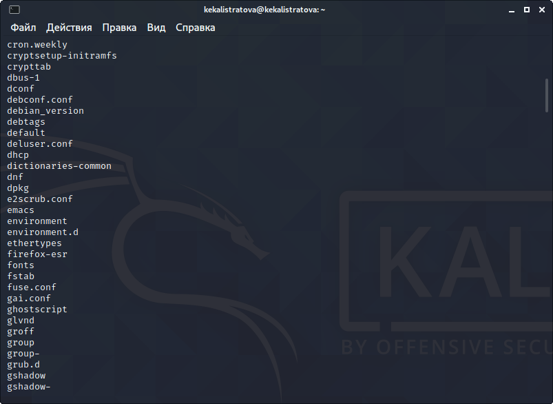

3. Вывожу имена всех файлов из file.txt, имеющих расширение .conf и записываюих в новый текстовой файл conf.txt с помощью команды «grep -e ‘\.conf$’ file.txt> conf.txt». Командой «cat conf.txt» проверяю 
правильность выполненных действий (рис. -@fig:002).

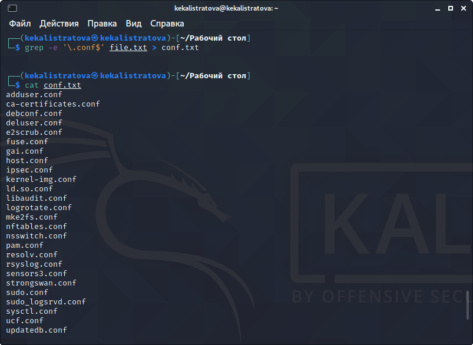

4. Определить, какие файлы в моем домашнем каталоге имеют имена, начинающиеся с символа c, можно несколькими командами: «find ~ -maxdepth1 -name “c*” -print» (опция maxdepth1 необходима для того, чтобы  файлы  находились  только  в  домашнем  каталоге (не  в  его подкаталогах)), «ls ~/c*» и «ls –a ~ | grep c*» (рис. -@fig:003).

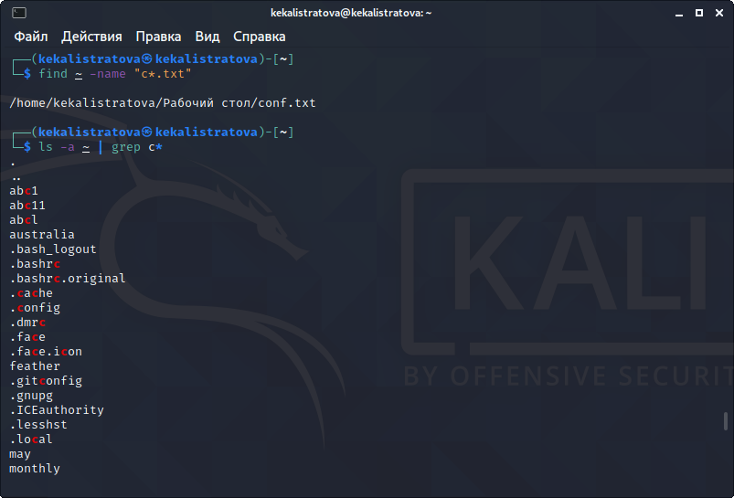

5. Чтобы вывести на экран (постранично) имена файлов из каталога /etc, начинающиеся  с  символа h, воспользуемся  командой «find /etc –maxdepth1 –name “h*” | less» (рис. -@fig:004, -@fig:005).

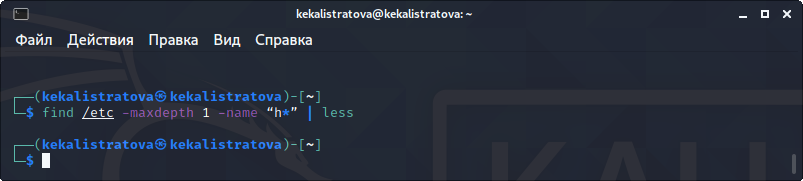

6. Запускаю в фоновом режиме процесс, который будет записывать в файл ~/logfile файлы, имена которых начинаются с log, используя команду «find/ -name “log*” > logfile &»(рис. -@fig:006).Командой «cat logfile» проверяю  выполненные  действия (рис. -@fig:007, -@fig:008). Далее  удаляю файл ~/logfile командой «rm logfile» (рис. -@fig:009).

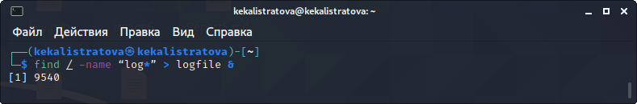

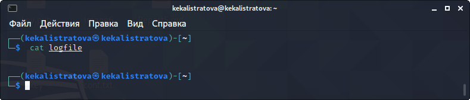

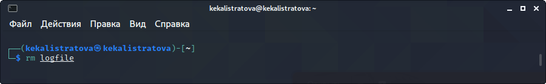

7. Запускаю  редактор gedit в  фоновом  режиме  командой «gedit &» (рис. -@fig:010). После этого на экране появляется окно редактора.

8. Чтобы определить идентификатор процесса gedit, использую команду «ps| grep-i“gedit”» (рис. -@fig:011). Из рисунка видно, что наш процесс имеет PID6028.Узнать  идентификатор  процесса  можно  также, используя команду «pidof gedit» или «pgrep gedit»

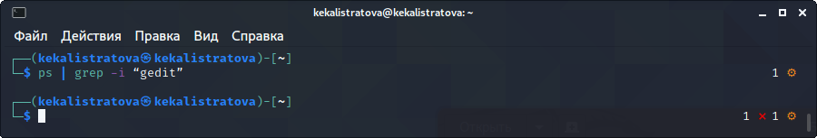
9. Прочитав информацию о команде kill с помощью команды «man kill», использую её  для  завершения  процесса gedit (команда «kill6386») (рис. -@fig:012, -@fig:013)

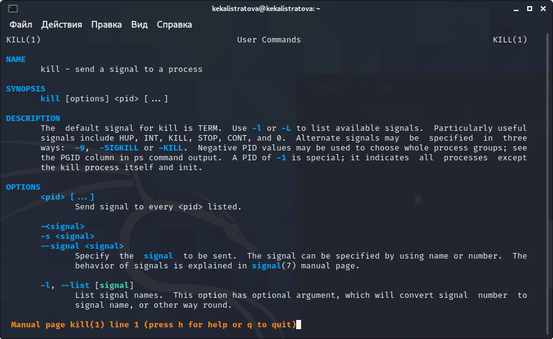

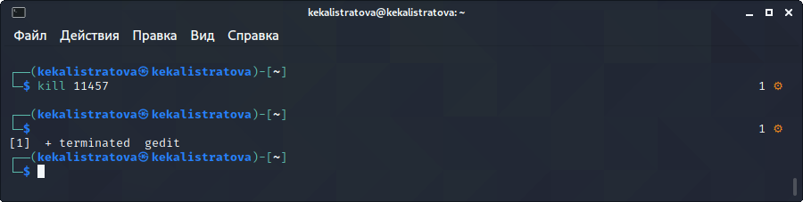

10. C помощью команд «man df»и «man du» узнаю информацию по необходимым командам и далее использую их (рис. -@fig:014, -@fig:015, -@fig:016, -@fig:017).

df – утилита,показывающаясписок всех файловых систем по именам устройств, сообщает их размер, занятое и свободное пространство и точки монтирования. Синтаксис: df [опции]у стройство

du – утилита,  предназначенная для  вывода  информации  об  объеме дискового  пространства,  занятого  файлами  и  директориями.  Она принимает путь к элементу файловой системы и выводит информацию о  количестве  байт  дискового  пространства  или  блоков  диска, задействованных для его хранения.Синтаксис: du [опции] каталог_или_файл
 
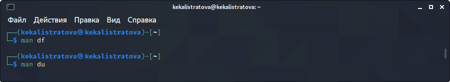
 
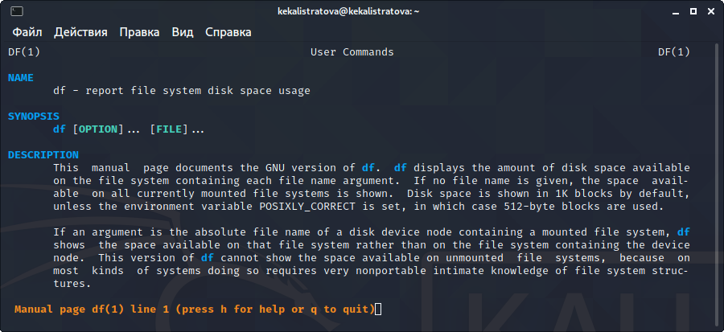
 
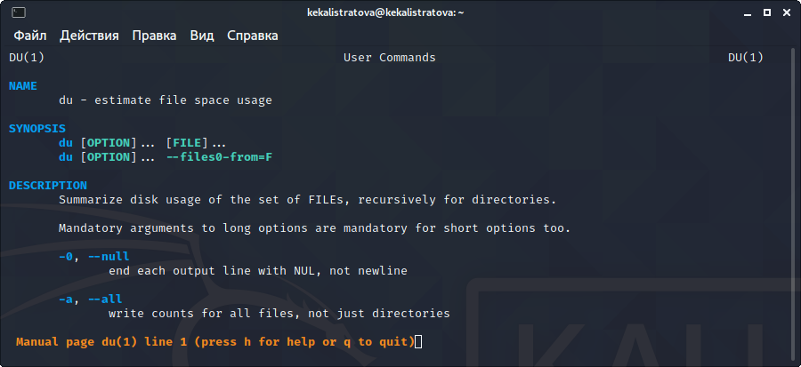

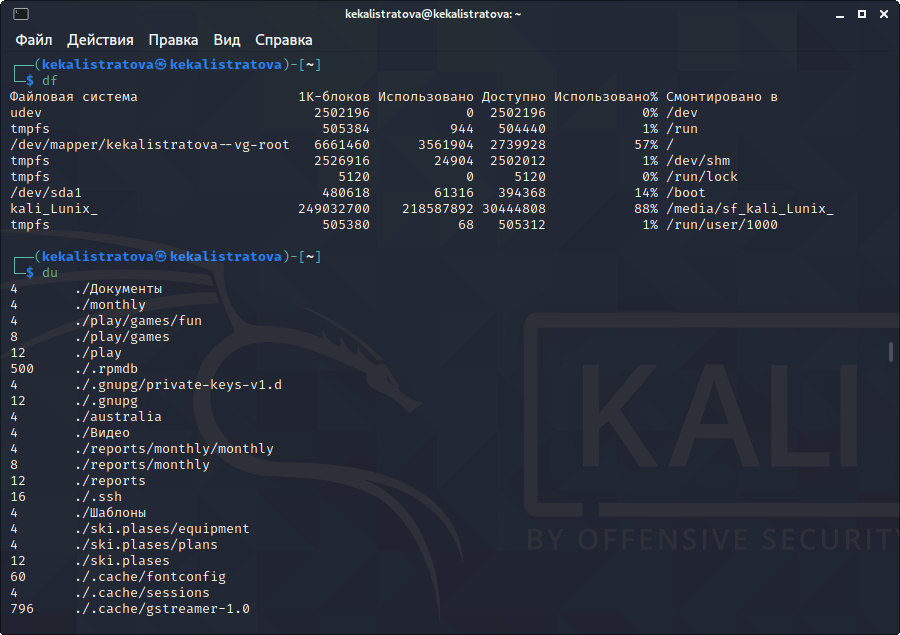

11. Вывожу имена  всех  директорий,имеющихся  в моем домашнем каталоге с помощью команды «find ~ -type d», предварительно получив информацию с помощью команды «man find» (рис. -@fig:018, -@fig:019) 

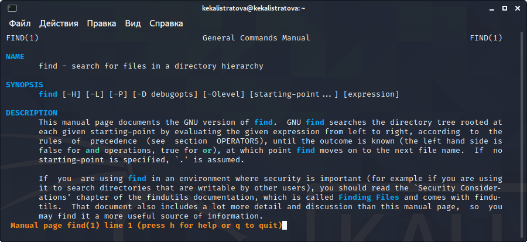

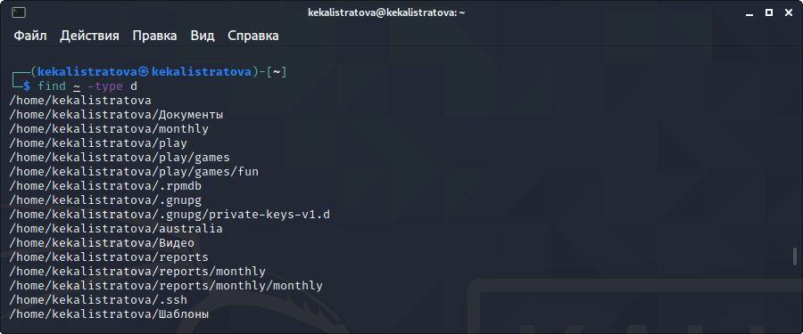

# Выводы

В  ходе  выполнения  данной  лабораторной  работы  я  изучила инструментыпоиска файлови фильтрации текстовых данных, а также приобрела  практические  навыки:  по  управлению  процессами  (и заданиями), по проверке использования диска и обслуживанию файловых систем.

# Ответы на контрольные вопросы

1. В системе по умолчанию открыто три специальных потока:

–stdin − стандартный поток ввода (по умолчанию: клавиатура), файловый дескриптор 0;

–stdout − стандартный поток вывода (по умолчанию: консоль), файловый дескриптор 1;

-stderr − стандартный поток вывод сообщений об ошибках (поумолчанию: консоль), файловый дескриптор 2.

Большинство используемых в консоли команд и программ записывают результаты своей работы в стандартный поток вывода stdout.
2. ">" - Перенаправление вывода в файл

">>" - Перенаправление вывода в файл и открытие файла в режиме добавления (данные добавляются в конец файла)/

3. Конвейер (pipe) служит для объединения простых команд или утилит в цепочки, в которых результат работы предыдущей команды передаётся последующей.

Синтаксис следующий:

команда1|команда2 (это означает, что вывод команды 1 передастся на ввод команде 2)

4. Процесс рассматривается операционной системой как заявка на потребление всех видов ресурсов, кроме одного − процессорного времени. Этот последний важнейший ресурс распределяется операционной системой между другими единицами работы − потоками, которые и получили свое название благодаря тому, что они представляют собой последовательности (потоки выполнения) команд.

Процесс − это выполнение программы. Он считается активной сущностью и реализует действия, указанные в программе.

Программа представляет собой статический набор команд, а процесс это набор ресурсов и данных, использующихся при выполнении программы.

5. pid: идентификатор процесса (PID) процесса (processID), к которому вызывают метод

gid: идентификатор группы UNIX, в котором работает программа.
6. Любую выполняющуюся в консоли команду или внешнюю программу можно запустить в фоновом режиме. Для этого следует в конце имени команды указать знак амперсанда &.

Запущенные фоном программы называются задачами (jobs). Ими можно управлять с помощью команды jobs, которая выводит список запущенных в данный момент задач.

7. top − это консольная программа, которая показывает список работающих процессов в системе. Программа в реальном времени отсортирует запущенные процессы по их нагрузке на процессор.

htop − это продвинутый консольный мониторинг процессов. Утилита выводит постоянно меняющийся список системных процессов, который сортируется в зависимости от нагрузки на ЦПУ. Если делать сравнение сtop, то htop показывает абсолютно все процессы в системе, время их непрерывного использования, загрузку процессоров и расход оперативной памяти.

8. find − это команда для поиска файлов и каталогов на основе специальных условий. Ее можно использовать в различных обстоятельствах, например, для поиска файлов по разрешениям, владельцам, группам, типу, размеру и другим подобным критериям.

Команда find имеет такой синтаксис:
find[папка][параметры] критерий шаблон [действие]

Папка − каталог в котором будем искать

Параметры − дополнительные параметры, например, глубина поиска, и т д.

Критерий − по какому критерию будем искать: имя, дата создания, права, владелец и т д.

Шаблон – непосредственно значение по которому будем отбирать файлы.

Основные параметры:

-P никогда не открывать символические ссылки

-L - получает информацию о файлах по символическим ссылкам. Важно для дальнейшей обработки, чтобы обрабатывалась не ссылка, а сам файл.

-maxdepth - максимальная глубина поиска по подкаталогам,для поиска только в текущем каталоге установите 1.

-depth - искать сначала в текущем каталоге, а потом в подкаталогах

-mount искать файлы только в этой файловой системе.

-version - показать версию утилиты find

-print - выводить полные имена файлов

-typef - искать только файлы

-typed - поиск папки в Linux

Основные критерии:

-name - поиск файлов по имени

-perm - поиск файлов в Linux по режиму доступа

-user - поиск файлов по владельцу

-group - поиск по группе

-mtime - поиск по времени модификации файла

-atime - поиск файлов по дате последнего чтения

-nogroup - поиск файлов, не принадлежащих ни одной группе

-nouser - поиск файлов без владельцев

-newer - найти файлы новее чем указанный

-size - поиск файлов в Linux по их
размеру

Примеры:

find~ -type d поиск директорий в домашнем каталоге

find~ -type f -name ".*" поиск скрытых файлов в домашнем каталоге
9. Файл по его содержимом у можно найти с помощью команды grep: «grep -r "слово/выражение, которое нужно найти"».

10. Утилита df,позволяет проанализировать свободное пространство на всех подключенных к системе разделах.

11. При выполнении команды du (без указания папкии опции) можно получить все файлы и папки текущей директории с их размерами. Для домашнего каталога:du~/

12. Основные сигналы (каждый сигнал имеет свой номер), которые используются для завершения процесса:

SIGINT–самый безобидный сигнал завершения, означает Interrupt. Он отправляется процессу, запущенному из терминала с помощью сочетания клавиш Ctrl+C. Процесс правильно завершает все свои действия и возвращает управление;

SIGQUIT- это  еще один сигнал, который отправляется с помощью сочетания клавиш, программе, запущенной в терминале. Он сообщает ей что нужно завершиться и программа может выполнить корректное завершение или проигнорировать сигнал. В отличие от предыдущего, она генерирует дамп памяти. Сочетание клавиш Ctrl+/;

SIGHUP– сообщает процессу, что соединение с управляющим терминалом разорвано,отправляется,в основном,системой при разрыве соединения с интернетом;

SIGTERM– немедленно завершает процесс, но обрабатывается программой, поэтому позволяет ей завершить дочерние процессы и освободить все ресурсы;

SIGKILL–тоже немедленно завершает процесс,но,в отличие от предыдущего варианта, он не передается самому процессу, а обрабатывается ядром. Поэтому ресурсы и дочерни епроцессы остаются запущенными.

 Также для передачи сигналов процессам в Linux используется утилита kill, её синтаксис: kill[-сигнал][pid_процесса](PID–уникальный идентификатор процесса). Сигнал представляет собой один из вышеперечисленных сигналов для завершения процесса. Перед тем,как выполнить остановку процесса, нужно определить его PID. Для этого используют команды ps и grep. Команда ps предназначена для
вывода списка активных процессов в системе и информации о них. Команда grep запускается одновременно с ps (в канале) и будет выполнять поиск по результатам команды ps. Утилитаp kill–это оболочка для kill, она ведет себя точно также, и имеет тот же синтаксис, только в качестве идентификатора процесса ей нужно передать его имя. kill all работает аналогично двум предыдущим утилитам. Она тоже принимает имя процесса в качестве параметра и ищет его PID в директории /proc. Но эта утилита обнаружит все процессы с таким именем и завершит их.
