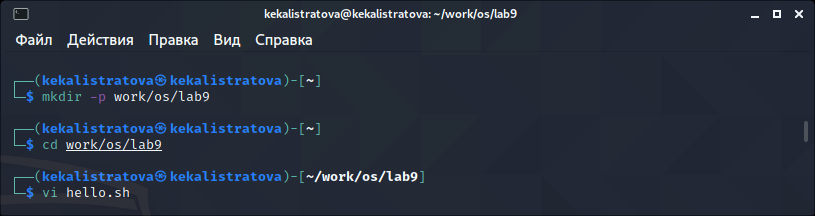
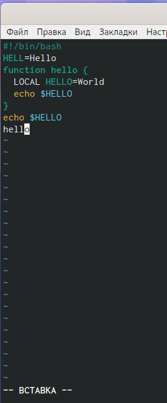
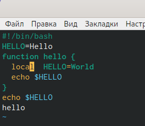

---
## Front matter
lang: ru-RU
title: Лабораторная работа №9
author: |
	Калистратова Ксения Евгеньевна\inst{1}
institute: |
	\inst{1}RUDN University, Moscow, Russian Federation
date: 18 мая, 2021, Москва, Россия

## Formatting
toc: false
slide_level: 2
theme: metropolis
header-includes: 
 - \metroset{progressbar=frametitle,sectionpage=progressbar,numbering=fraction}
 - '\makeatletter'
 - '\beamer@ignorenonframefalse'
 - '\makeatother'
aspectratio: 43
section-titles: true
---

## Цель работы

Познакомиться с операционной системой Linux. Получить практические  навыки  работы  с  редактором vi, установленным по умолчанию практически во всех дистрибутивах.

## Задачи

1. Познакомиться с текстовым редактором vi.
2. Изучить режимы vi (командный режим, режим вставки, режим последней строки).
3. Изучить команды управления.
4. В ходе работы использовать эти команды и интерпретировать их вывод.
5. Выполнить отчет.

## Выполнение лабораторной работы

Создаем каталог. Перейдя в него, вызываем vi и создаем новый файл. Используем изученные команды для ввода текста, перехода в командный режим, в режим последней строки, сохранения и выхода. (рис. -@fig:001) 

{ #fig:001 width=70% }

## Выполнение лабораторной работы

(рис. -@fig:002)

{ #fig:002 width=70% }

## Выполнение лабораторной работы

Вызываем vi на редактирование файла. Используем различные команды для вставки, удаления слов или строк. Используем команду отмены изменений "u". (рис. -@fig:003)

{ #fig:003 width=70% }

## Вывод

В ходе выполнения данной лабораторной работы я познакомилась с операционной системой Linux и получила практические навыки работы с редактором vi.

