---
# Front matter
lang: ru-RU
title: "Отчет по лабораторной работе №9"
subtitle: "Дисциплина: Операционные системы"
author: "Калистратова Ксения Евгеньевна"

# Formatting
toc-title: "Содержание"
toc: true # Table of contents
toc_depth: 2
lof: true # List of figures
fontsize: 12pt
linestretch: 1.5
papersize: a4paper
documentclass: scrreprt
polyglossia-lang: russian
polyglossia-otherlangs: english
mainfont: PT Serif
romanfont: PT Serif
sansfont: PT Sans
monofont: PT Mono
mainfontoptions: Ligatures=TeX
romanfontoptions: Ligatures=TeX
sansfontoptions: Ligatures=TeX,Scale=MatchLowercase
monofontoptions: Scale=MatchLowercase
indent: true
pdf-engine: lualatex
header-includes:
  - \linepenalty=10 # the penalty added to the badness of each line within a paragraph (no associated penalty node) Increasing the value makes tex try to have fewer lines in the paragraph.
  - \interlinepenalty=0 # value of the penalty (node) added after each line of a paragraph.
  - \hyphenpenalty=50 # the penalty for line breaking at an automatically inserted hyphen
  - \exhyphenpenalty=50 # the penalty for line breaking at an explicit hyphen
  - \binoppenalty=700 # the penalty for breaking a line at a binary operator
  - \relpenalty=500 # the penalty for breaking a line at a relation
  - \clubpenalty=150 # extra penalty for breaking after first line of a paragraph
  - \widowpenalty=150 # extra penalty for breaking before last line of a paragraph
  - \displaywidowpenalty=50 # extra penalty for breaking before last line before a display math
  - \brokenpenalty=100 # extra penalty for page breaking after a hyphenated line
  - \predisplaypenalty=10000 # penalty for breaking before a display
  - \postdisplaypenalty=0 # penalty for breaking after a display
  - \floatingpenalty = 20000 # penalty for splitting an insertion (can only be split footnote in standard LaTeX)
  - \raggedbottom # or \flushbottom
  - \usepackage{float} # keep figures where there are in the text
  - \floatplacement{figure}{H} # keep figures where there are in the text
---

# Цель работы

Познакомиться с операционной системой Linux. Получить практические  навыки  работы  с  редактором vi, установленным  по умолчанию практически во всех дистрибутивах.

# Задачи

1. Познакомиться с текстовым редактором vi.
2. Изучить режимы vi (командный режим, режим вставки, режим последней строки).
3. Изучить команды управления.
4. В ходе работы использовать эти команды и интерпретировать их вывод.
5. Выполнить отчет.

# Выполнение лабораторной работы

>> Задание 1. Создание нового файла с использованием vi

1) Создаем в домашней папке каталог work/os/lab9, используя команду «mkdir -p work/os/lab9», где опция -p позволяет создать все каталоги, которые указаны внутри пути. (рис. -@fig:001)

2) Командой «cd work/os/lab9» переходим в созданный каталог. (рис. -@fig:001)

3) Вызываем vi и создаем файл hello.shс помощью команды «vi hello.sh». (рис. -@fig:001)

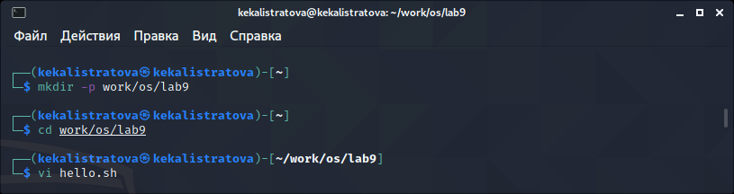{ #fig:001 width=70% }

4) Нажимаем клавишу «i» и вводим текст, указанный в лабораторной работе. (рис. -@fig:002) 

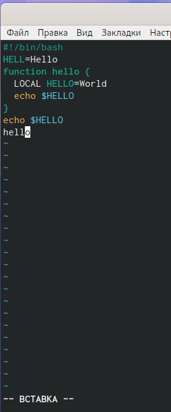{ #fig:002 width=70% }

5) Нажимаем клавишу «esc», чтобы перейти в командный режим после завершения ввода текста. (рис. -@fig:003) 

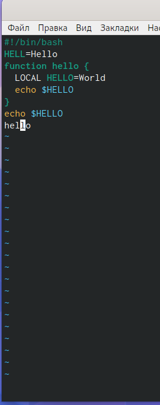{ #fig:003 width=70% }

6) Нажимаем «:» для перехода в режим последней строки и внизу экрана видим, что появилось приглашение в виде двоеточия. (рис. -@fig:004)

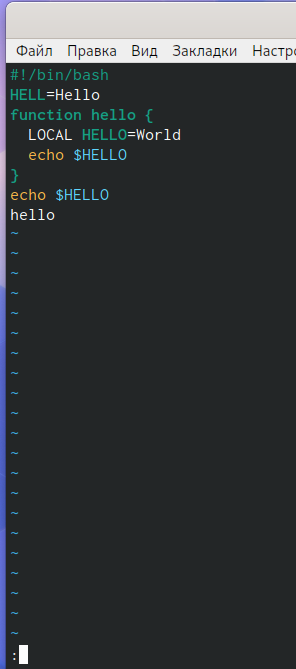{ #fig:004 width=70% }

7) Нажимаем «w» (записать) и «q» (выйти), далее нажимаем клавишу «enter» для сохранения текста и завершения работы. (рис. -@fig:005) 

{ #fig:005 width=70% }

8) Чтобы сделать файл исполняемым, используем команду «chmod +x hello.sh». (рис. -@fig:006) 

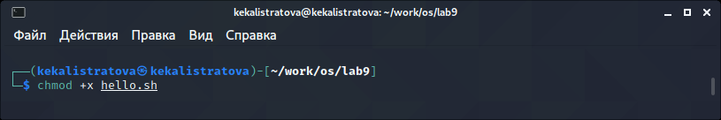{ #fig:006 width=70% }

>> Задание 2. Редактирование существующего файла

1) Вызовем vi для редактирования файла с помощью  команды «vi ~/work/os/lab06/hello.sh» 
(рис. -@fig:007) (рис. -@fig:008) 

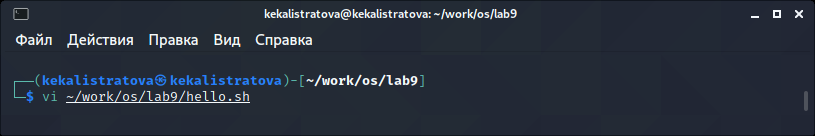{ #fig:007 width=70% }

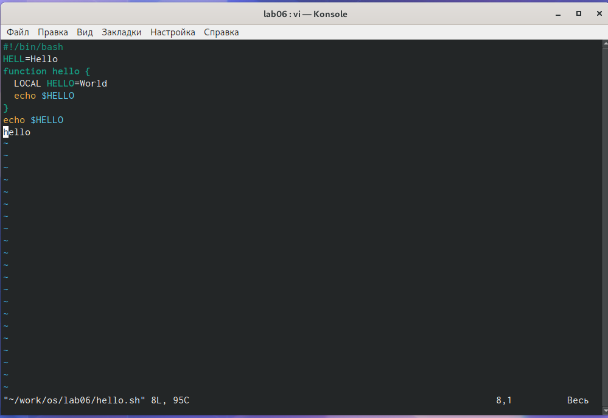{ #fig:008 width=70% }

2) Далее с помощью стрелок установила курсор в конец слова HELL второй строки. (рис. -@fig:009)

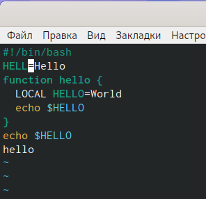{ #fig:009 width=70% }

3) Перейдем в режим вставки, нажав на клавишу «i», и заменим HELL на HELLO, дописав O. Нажмем«esc»для возврата в командный режим. (рис. -@fig:010)
   
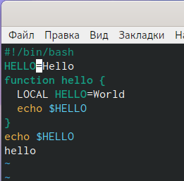{ #fig:010 width=70% } 
   
4) С помощью стрелок установим курсор на четвертую строку и сотрем слово LOCAL с помощью комбинации клавиш «d» (delete) и «w» (word). (рис. -@fig:011) (рис. -@fig:012)

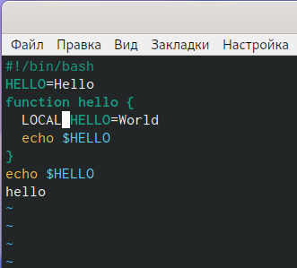{ #fig:011 width=70% } 

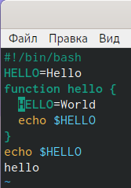{ #fig:012 width=70% } 

5) Перейдем в режим вставки, нажав клавишу «i», и наберем следующий текст: local. Нажмем «esc» для возврата в командный режим. (рис. -@fig:013) 

{ #fig:013 width=70% } 

6) Установим курсор на последней строке файла, используя стрелки. Вставим после неё строку, содержащую следующий текст: echo $HELLO (рис. -@fig:014)

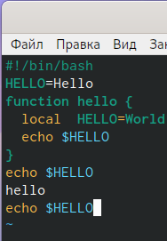{ #fig:014 width=70% } 

7) Далее нажимаем «esc», чтобы перейти в командный режим.(рис. -@fig:015)

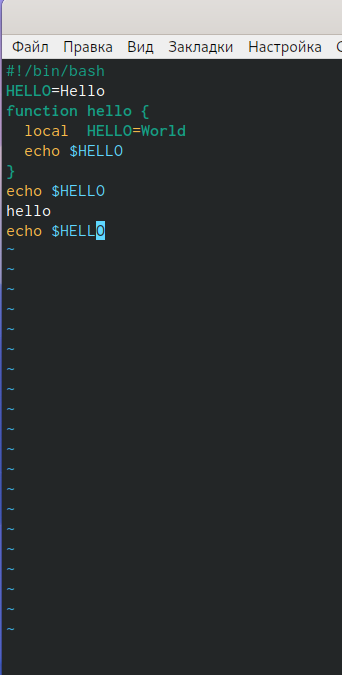{ #fig:015 width=70% }

8) Удаляем  последнюю  строку,  используя  комбинацию  клавиш «d» и «d». (рис. -@fig:016)

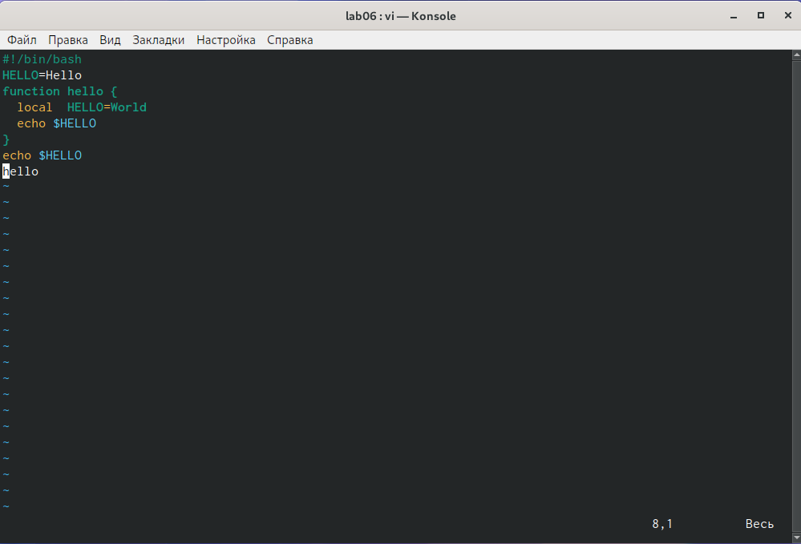{ #fig:016 width=70% } 

9) Введем команду отмены изменений «u» для отмены последней команды. (рис. -@fig:017)

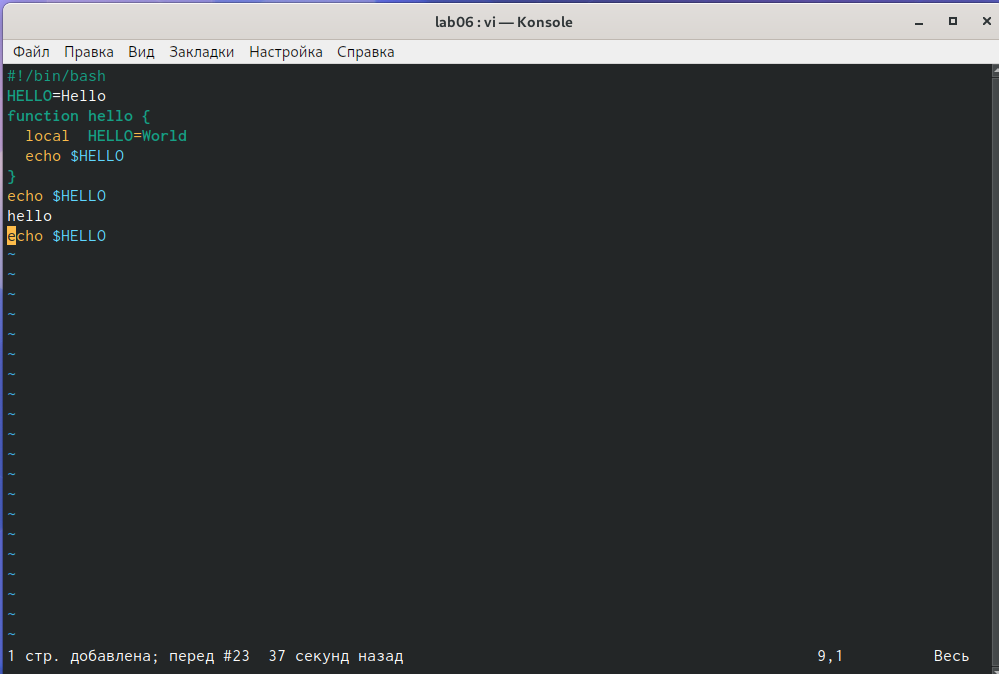{ #fig:017 width=70% }

10) Введем символ «:» для перехода в режим последней строки. Запишем произведённые изменения, нажав «w» и «q» и выйдем из vi. (рис. -@fig:018)

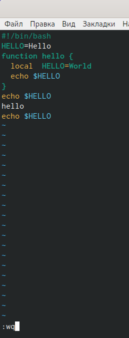{ #fig:018 width=70% } 

# Контрольные вопросы

1) Редактор vi имеет три режима работы: 

- командный режим − предназначен для ввода команд редактирования и навигации по редактируемому файлу;

- режим  вставки  − предназначен  для  ввода  содержания редактируемого файла; 

- режим последней (или командной) строки − используется для записи изменений в файл и выхода из редактора.

2) Чтобы выйти из редактора, не сохраняя произведённые изменения, нужно в режиме командной строки нажать клавиши «:» «q» «!»

3) Команды позиционирования:

- «0»(ноль) − переход в начало строки; 

- «$» − переход в конец строки; 

- «G» − переход в конец файла;

- n«G» − переход на строку с номером n.

4) При использовании прописных W и B под разделителями понимаются только  пробел,  табуляция  и  возврат  каретки.  При  использовании строчных w и b под разделителями понимаются также любые знаки пунктуации.

5) Чтобы из любого места редактируемого файла перейти в начало (конец) файла, нужно в режиме командной строки нажать клавиши «1» «G» («G»).

6) Команды редактирования:

**Вставка текста**

- «а» − вставить текст после курсора; 

- «А» − вставить текст в конец строки;

- «i» − вставить текст перед курсором;

- n «i» − вставить текст n раз;

- «I» − вставить текст в начало строки.

**Вставка строки**

- «о» − вставить строку под курсором;

- «О» − вставить строку над курсором.

**Удаление текста**

- «x» − удалить один символ в буфер;

- «d» «w» − удалить одно слово в буфер;

- «d» «$» − удалить в буфер текст от курсора до конца строки;

- «d» «0» − удалить в буфер текст от начала строки до позиции курсора;

- «d» «d» − удалить в буфер одну строку;

- n «d» «d» − удалить в буфер n строк. 

**Отмена и повтор произведённых изменений**

- «u» − отменить последнее изменение; 

- «.» − повторить последнее изменение.

**Копирование текста в буфер**

- «Y» − скопировать строку в буфер;

- n «Y» − скопировать n строк в буфер;

- «y» «w» − скопировать слово в буфер.

**Вставка текста из буфера**

- «p» − вставить текст из буфера после курсора;

- «P» − вставить текст из буфера перед курсором.

**Замена текста**

- «c» «w» − заменить слово;

- n «c» «w» − заменить nслов;

- «c» «$» − заменить текст от курсора до конца строки;

- «r» − заменить слово;

- «R» − заменить текст.

**Поиск текста**

- «/» текст − произвести поиск вперёд по тексту указанной строки символов текст;

- «?» текст − произвести поиск назад по тексту указанной строки символов текст.

**Копирование и перемещение текста**

- «:» n,m «d» – удалить строки с n по m;

- «:» i,j «m» k – переместить строки с i по j, начиная со строки k;

- «:» i,j «t» k – копировать строки с i по j в строку k;

- «:» i,j «w» имя-файла – записать строки с i по j в файл с именем имя-файла.

7) Чтобы заполнить строку символами $, необходимо для начала перейти на эту строку, нажав клавиши n «G», где n – номер строки, далее нажать «0» для перехода в начало строки. Теперь необходимо нажать «c» «$», чтобы заменить текст от курсора до конца строки, и ввести символы $.

8) Чтобы отменить по одному предыдущему действию последовательно, необходимо нажать «u». Чтобы отменить все изменения, произведённые со времени последней записи, нужно нажать «:» «e» «!».

9) Команды редактирования в режиме командной строки

**Копирование и перемещение текста**

- «:»n,m «d» − удалить строки с n по m;

- «:»i,j «m» k − переместить строки с i по j, начиная со строки k;

- «:»i,j «t» k − копировать строки с i по j в строку k;

- «:»i,j «w» имя-файла − записать строки с i по j в файл с именем имя-файла.

**Запись в файл и выход из редактора**

- «:» «w» − записать изменённый текст в файл, не выходя из vi;

- «:» «w» имя-файла − записать изменённый текст в новый файл с именем имя-файла;

- «:» «w» «!» имя-файла − записать изменённый текст в файл с именем имя-файла;

- «:» «w» «q» − записать изменения в файл и выйти из vi;

- «:» «q» − выйти из редактора vi;

- «:» «q» «!» − выйти из редактора без записи;

- «:» «e» «!» − вернуться  в  командный  режим,  отменив  все изменения, произведённые со времени последней записи.

**Опции**

Опции редактора vi позволяют настроить рабочую среду. Для задания опций используется команда set (в режиме последней строки):

- «:»set all − вывести полный список опций;

- «:»set nu − вывести номера строк;

- «:»set list − вывести невидимые символы;

- «:»set  ic − не  учитывать  при  поиске,  является  ли  символ прописным или строчным.

Если вы хотите отказаться от использования опции, то в команде set перед именем опции надо поставить no.

10) Чтобы определить,  не  перемещая  курсора,  позицию,  в  которой заканчивается строка, нужно в командном режиме находясь на нужной строке нажать «$»и посмотреть на число после запятой в правом нижнем углу экрана. (рис. -@fig:019)

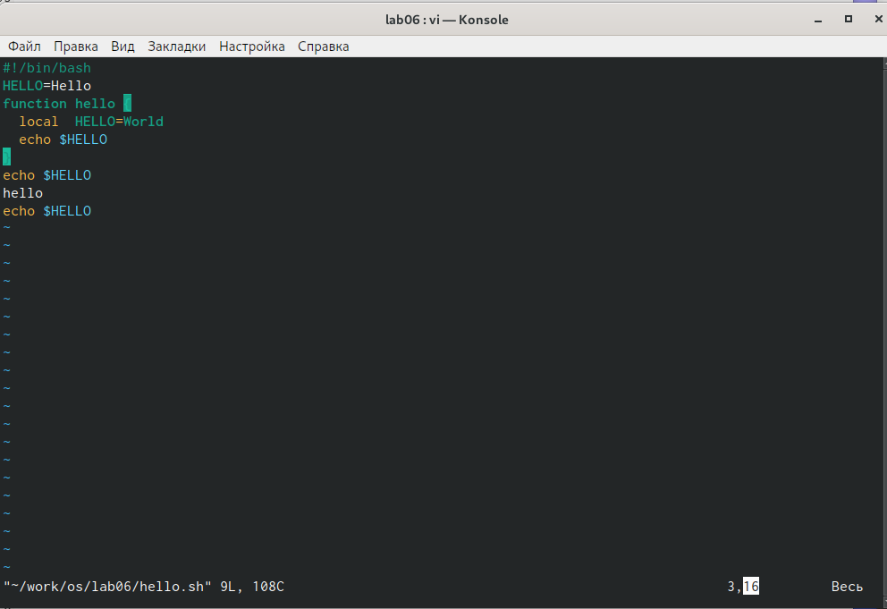{ #fig:019 width=70% } 

11) Опции  редактора vi позволяют  настроить  рабочую  среду.  Для задания опций используется команда set (в режиме командной строки). Если вы хотите отказаться от использования опции, то в команде set перед именем опции надо поставить no. Чтобы просмотреть опции редактора vi, необходимо нажать «:» set all. Нажав «:» help “название_опции”, можно узнать назначение конкретной опции. (рис. -@fig:020)

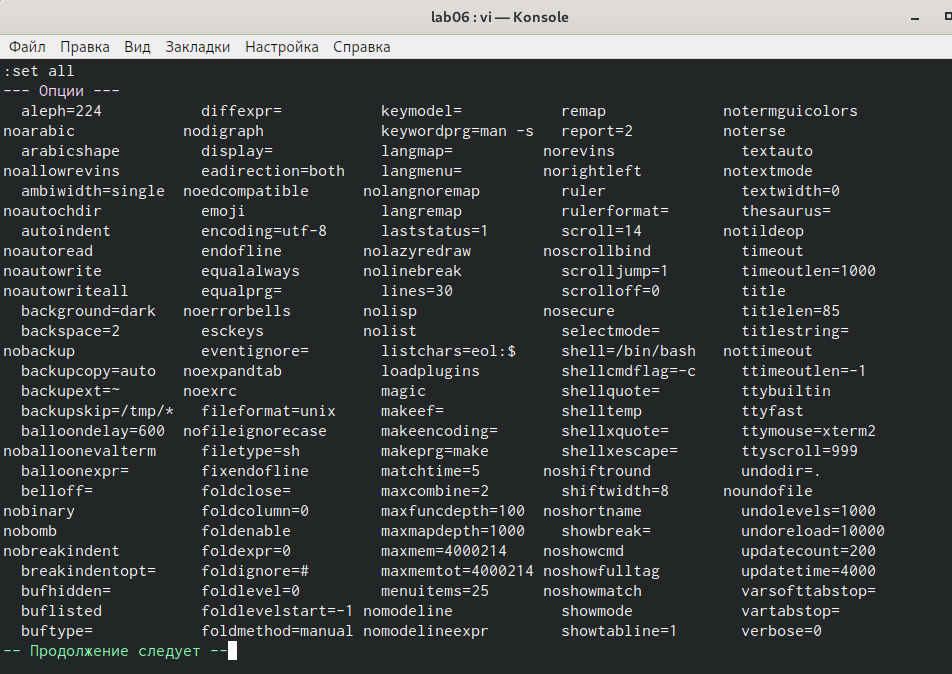{ #fig:020 width=70% } 

12) В режиме командной строки внизу редактора присутствует «:», в режиме ввода – «--ВСТАВКА --», в командном режиме внизу ничего нет.

13) Граф взаимосвязи режимов работы редактора vi. (рис. -@fig:021)

{ #fig:021 width=70% } 

# Выводы

В ходе выполнения данной лабораторной работы я познакомилась с операционной системой Linux и получила практические навыки работы с редактором vi.

# Библиография

1. https://esystem.rudn.ru/pluginfile.php/1142084/mod_resource/content/2/006-lab_vi.pdf

2. Кулябов Д.С. Операционные системы: лабораторные работы: учебное пособие / Д.С. Кулябов, М.Н. Геворкян, А.В. Королькова, А.В. Демидова. — М. : Изд-во РУДН, 2016. — 117 с. — ISBN 978-5-209-07626-1 : 139.13; То же [Электронный ресурс]. — URL: http://lib.rudn.ru/MegaPro2/Download/MObject/6118.

3. Робачевский А.М. Операционная система UNIХ [текст] : Учебное пособие / А.М. Робачевский, С.А. Немнюгин, О.Л. Стесик. — 2-е изд., перераб. и доп. — СПб. : БХВ-Петербург, 2005, 2010. — 656 с. : ил. — ISBN 5-94157-538-6 : 164.56. (ЕТ 60)

4. Таненбаум Эндрю. Современные операционные системы [Текст] / Э. Таненбаум. — 2-е изд. — СПб. : Питер, 2006. — 1038 с. : ил. — (Классика Computer Science). — ISBN 5-318-00299-4 : 446.05. (ЕТ 50)