---
# Front matter
lang: ru-RU
title: "Отчет по лабораторной работе №10"
subtitle: "Дисциплина: Операционные системы"
author: "Калистратова Ксения Евгеньевна"

# Formatting
toc-title: "Содержание"
toc: true # Table of contents
toc_depth: 2
lof: true # List of figures
fontsize: 12pt
linestretch: 1.5
papersize: a4paper
documentclass: scrreprt
polyglossia-lang: russian
polyglossia-otherlangs: english
mainfont: PT Serif
romanfont: PT Serif
sansfont: PT Sans
monofont: PT Mono
mainfontoptions: Ligatures=TeX
romanfontoptions: Ligatures=TeX
sansfontoptions: Ligatures=TeX,Scale=MatchLowercase
monofontoptions: Scale=MatchLowercase
indent: true
pdf-engine: lualatex
header-includes:
  - \linepenalty=10 # the penalty added to the badness of each line within a paragraph (no associated penalty node) Increasing the value makes tex try to have fewer lines in the paragraph.
  - \interlinepenalty=0 # value of the penalty (node) added after each line of a paragraph.
  - \hyphenpenalty=50 # the penalty for line breaking at an automatically inserted hyphen
  - \exhyphenpenalty=50 # the penalty for line breaking at an explicit hyphen
  - \binoppenalty=700 # the penalty for breaking a line at a binary operator
  - \relpenalty=500 # the penalty for breaking a line at a relation
  - \clubpenalty=150 # extra penalty for breaking after first line of a paragraph
  - \widowpenalty=150 # extra penalty for breaking before last line of a paragraph
  - \displaywidowpenalty=50 # extra penalty for breaking before last line before a display math
  - \brokenpenalty=100 # extra penalty for page breaking after a hyphenated line
  - \predisplaypenalty=10000 # penalty for breaking before a display
  - \postdisplaypenalty=0 # penalty for breaking after a display
  - \floatingpenalty = 20000 # penalty for splitting an insertion (can only be split footnote in standard LaTeX)
  - \raggedbottom # or \flushbottom
  - \usepackage{float} # keep figures where there are in the text
  - \floatplacement{figure}{H} # keep figures where there are in the text
---

# Цель работы

Познакомиться с операционной системой Linux. Получить практические навыки работы с редактором Emacs.

# Задачи

1. Познакомиться с текстовым редактором emacs.
2. Изучить команды управления (для перемещения курсора, работы с текстом, работы с выделенной областью текста, для поиска и замены).
3. В ходе работы использовать эти команды и интерпретировать их вывод.
4. Выполнить отчет.

# Выполнение лабораторной работы

1. Откроем редактор Emacs с помощью команды «emacs &». (рис. -@fig:001)

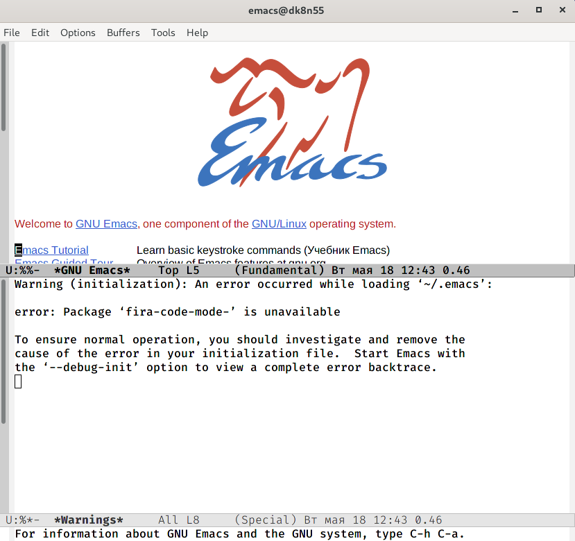{ #fig:001 width=70% }

2. Создадим файл lab07.sh с помощью комбинации «Ctrl-x»«Ctrl-f». (рис. -@fig:002) 

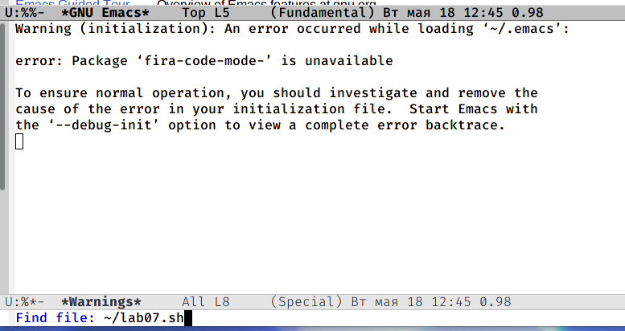{ #fig:002 width=70% }

3. В открывшемся буфере наберем необходимый текст. (рис. -@fig:003) 

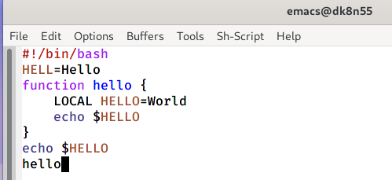{ #fig:003 width=70% }

4. Сохраним файл с помощью комбинации «Ctrl-x»«Ctrl-s».

5. Проделаем с текстом стандартные процедуры редактирования, каждое действие должно осуществляться комбинацией клавиш.

5.1. Вырежем одной командой целую строку («Сtrl-k»). (рис. -@fig:004)

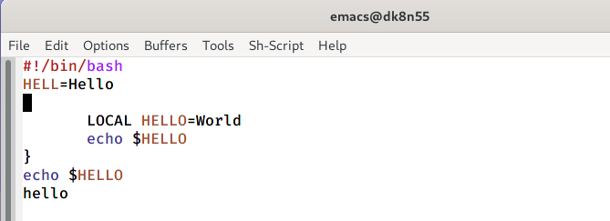{ #fig:004 width=70% }

5.2. Вставим эту строку в конец файла («Ctrl-y»). (рис. -@fig:005) 

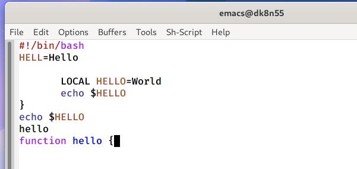{ #fig:005 width=70% }

5.3. Выделим область текста («Ctrl-space»). (рис. -@fig:006) 

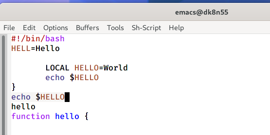{ #fig:006 width=70% }

5.4. Скопируем область в буфер обмена («Alt-w»). 

5.5. Вставим область в конец файла(«Ctrl-y»). (рис. -@fig:007)

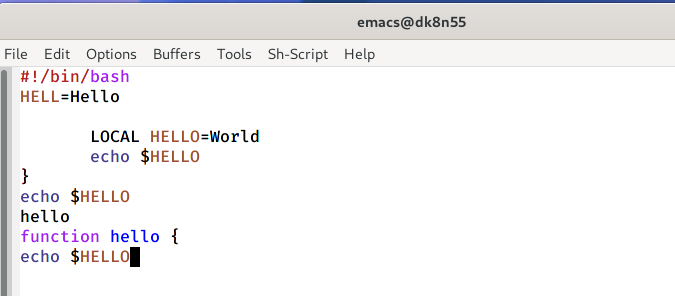{ #fig:007 width=70% }

5.6. Вновь выделим эту область(«Ctrl-space») и на этот раз вырежем её («Ctrl-w»). (рис. -@fig:008)

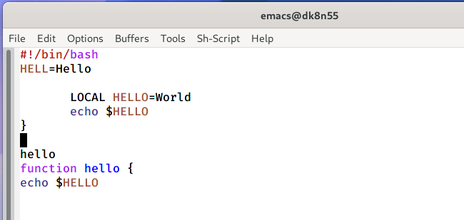{ #fig:008 width=70% }

5.7. Отменим последнее действие («Ctrl-/»). (рис. -@fig:009)

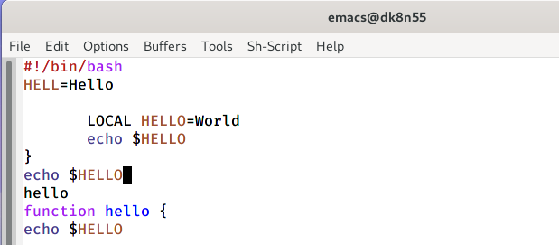{ #fig:009 width=70% }

6. Учимся использовать команды по перемещению курсора.

6.1. Переместим курсор в начало строки («Ctrl-a»). (рис. -@fig:010)
   
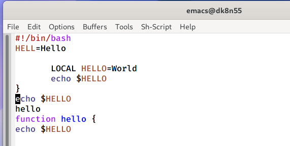{ #fig:010 width=70% } 
   
6.2. Переместим курсор в конец строки («Ctrl-e»). (рис. -@fig:011) 

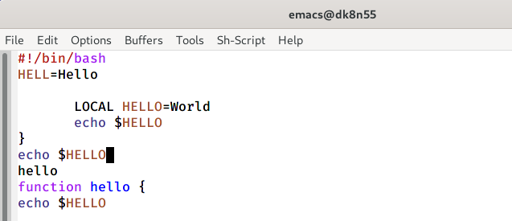{ #fig:011 width=70% } 

6.3. Переместим курсор в начало буфера («Alt-<») (рис. -@fig:012)

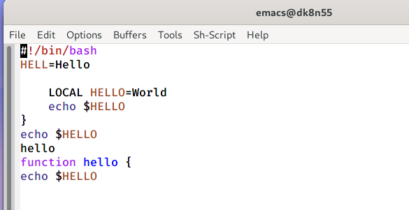{ #fig:012 width=70% } 

6.4. Переместим курсор в начало буфера («Alt->»). (рис. -@fig:013) 

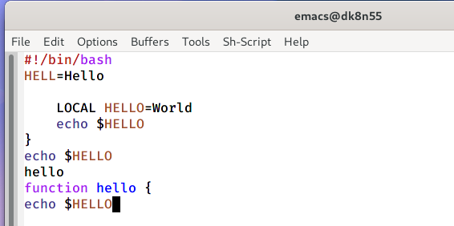{ #fig:013 width=70% } 

7. Управление буферами.

7.1. Выведем список активных буферов на экран («Ctrl-x»«Ctrl-b»). (рис. -@fig:014)

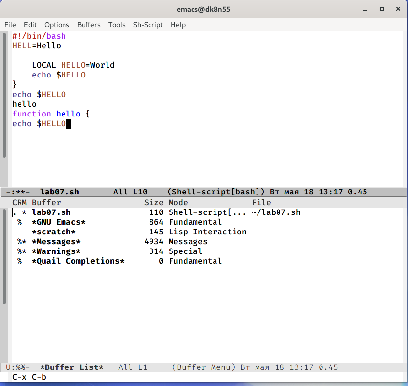{ #fig:014 width=70% } 

7.2. Переместимся во  вновь  открытое  окно  («Ctrl-xo») со  списком открытых буферов и переключимся на другой буфер (для этого необходимо нажать на «enter» после выбора необходимого буфера). (рис. -@fig:015)

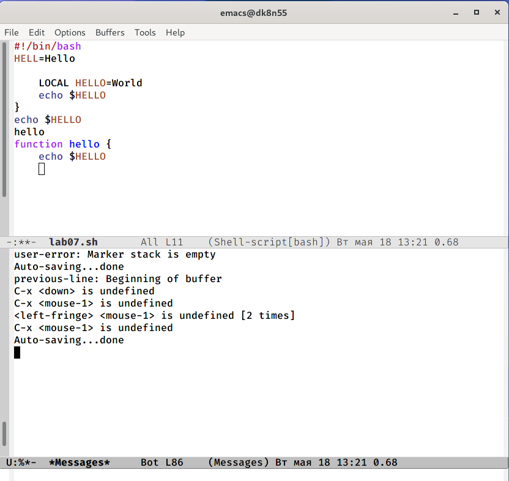{ #fig:015 width=70% }

7.3. Закроем это окно. (рис. -@fig:016)

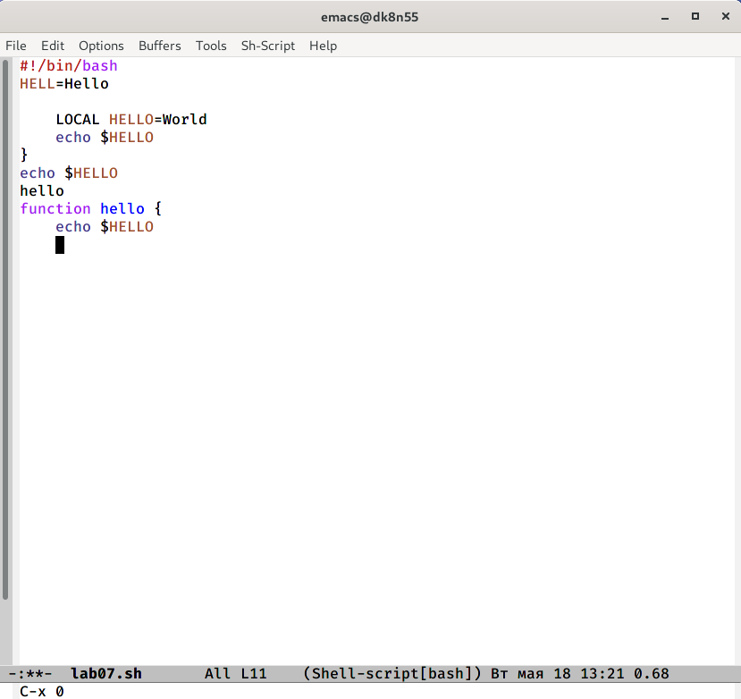{ #fig:016 width=70% } 

7.4. Теперь вновь переключимся между буферами, но уже без вывода их списка на экран («Ctrl-x b»). (рис. -@fig:017) (рис. -@fig:018)

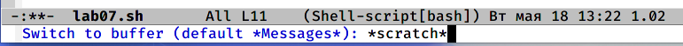{ #fig:017 width=70% }

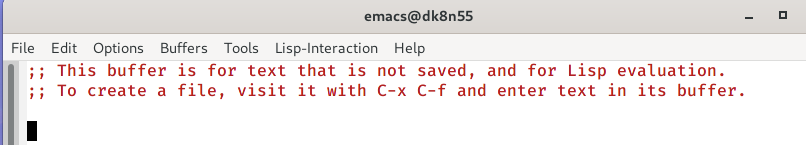{ #fig:018 width=70% }

8. Управление окнами.

8.1. Поделим фрейм на 4 части: разделим фрейм на два окна по вертикали («Ctrl-x 3»), а затем каждое из этих окон на две части по горизонтали («Ctrl-x 2»). (рис. -@fig:019)

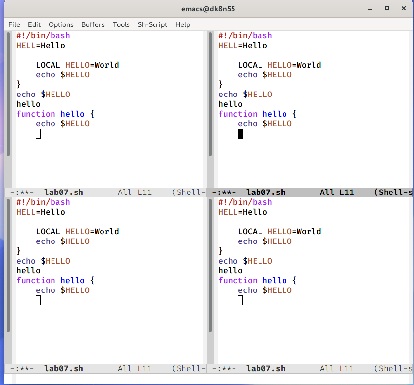{ #fig:019 width=70% }

8.2. В каждом из четырёх созданных окон откроем новый буфер (файл) и введем несколько строк текста. Для этого предварительно создадим эти файлы с помощью команд «touch example1.txt»,«touch example2.txt», «touch example3.txt», «touch example4.txt». (рис. -@fig:020) (рис. -@fig:021) (рис. -@fig:022)

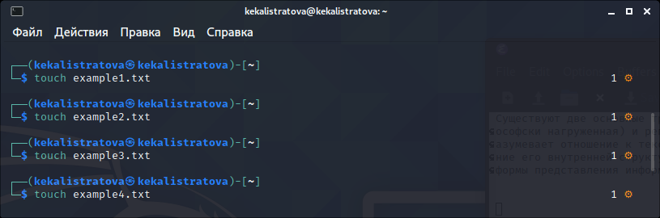{ #fig:020 width=70% }

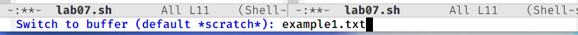{ #fig:021 width=70% }

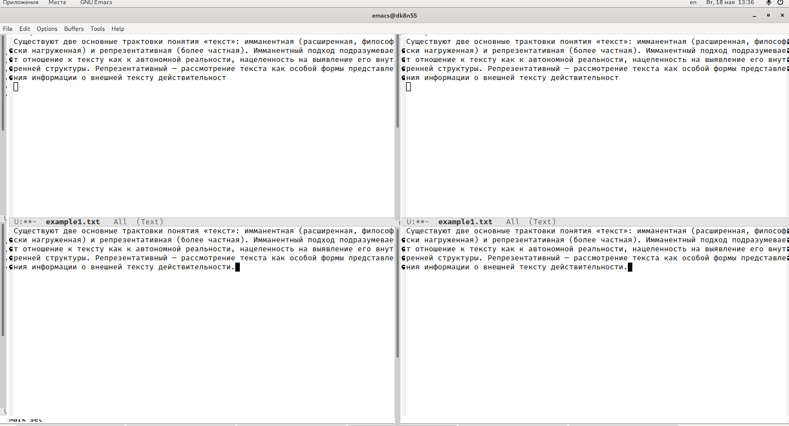{ #fig:022 width=70% }

9. Режим посика.

9.1. Переключимся в режим поиска («Ctrl-s») и найдем несколько слов, присутствующих в тексте. (рис. -@fig:023) (рис. -@fig:024)

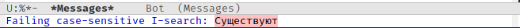{ #fig:023 width=70% }

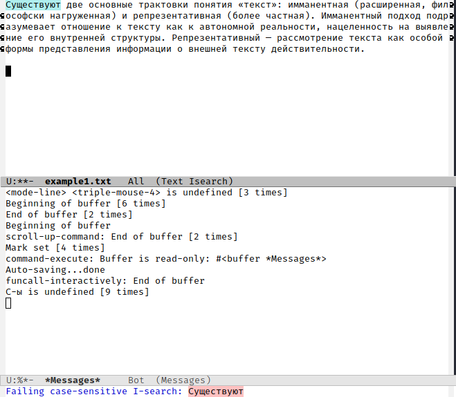{ #fig:024 width=70% }

9.2. Переключимся между  результатами  поиска,  нажимая «Ctrl-s». (рис. -@fig:025)

{ #fig:025 width=70% }

9.3. Выйдем из режима поиска, нажав «Ctrl-g».

9.4. Перейдем в  режим  поиска  и  замены  («Alt-%»),  введем текст, который следует найти и заменить, нажмем «enter», затем введем текст для  замены.  После  того  как  будут  подсвечены  результаты  поиска, нажмем «!» для подтверждения замены. Важно, чтобы курсор находился в начале текста. (рис. -@fig:026) (рис. -@fig:027) (рис. -@fig:028) (рис. -@fig:029)

{ #fig:026 width=70% }

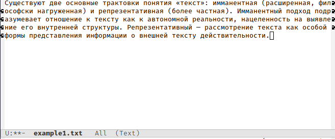{ #fig:027 width=70% }

{ #fig:028 width=70% }

{ #fig:029 width=70% }

9.5. Пробуем другой режим поиска, нажав «Alt-s o». Но у меня не сработала эта комбинация, поэтому я воспользовалась «Alt-x occur». (рис. -@fig:030) (рис. -@fig:031)

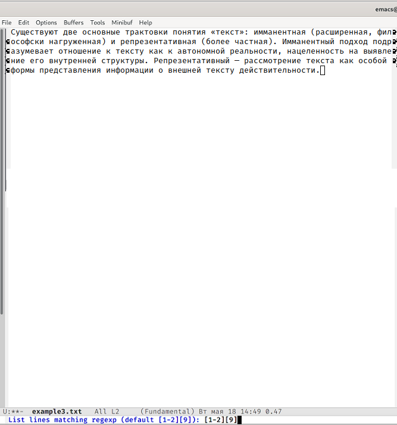{ #fig:030 width=70% }

Данный вид поиска отличается от обычного тем, что тут считывается строка поиска,  которая трактуется как  регулярное  выражение, и не осуществляется поиск точного совпадения в тексте буфера. Регулярное выражение − это образец, который обозначает набор строк, возможно, и неограниченный набор.

# Контрольные вопросы

1) Emacs − один  из  наиболее  мощных  и  широко  распространённых редакторов,  используемых  в  мире Unix. По популярности он соперничает с редактором vi и его клонами. В зависимости от ситуации, Emacs может быть:

- текстовым редактором;

- программой для чтения почты и новостей Usenet;

- интегрированной средой разработки (IDE);

- операционной системой и т.д.

Всё  это  разнообразие  достигается  благодаря  архитектуре Emacs, которая  позволяет  расширять  возможности  редактора  при  помощи языка Emacs  Lisp. На  языке C написаны  лишь  самые  базовые  и низкоуровневые  части Emacs, включая  полнофункциональный интерпретатор языка Lisp. Таким образом, Emacs имеет встроенный язык программирования, который может использоваться для настройки, расширения  и  изменения  поведения  редактора.  В  действительности, большая часть того редактора, с которым пользователи Emacs работают в наши дни,написана на языке Lisp.

2) Основную трудность для новичков при освоении данного редактора могут составлять  большое  количество  команд,  комбинаций  клавиш, которые не получится все запомнить с первого раза и поэтому придется часто обращаться к справочным материалам.

3) Буфер – это  объект, представляющий собой текст. Если имеется несколько буферов, то редактировать можно только один. Обычно буфер считывает данные из файла или записывает в файл данные из буфера.

Окно – это область экрана, отображающая буфер. При запуске редактора отображается одно окно, но при обращении к некоторым функциям могут открыться дополнительные окна. Окна Emacs и окна графической среды X Window – разные вещи. Одно окно X Window может быть разбито  на  несколько  окон  в  смысле Emacs,  в  каждом  из  которых отображается отдельный буфер.

4) Да, можно.

5) При запуске Emacs по умолчанию создаются следующие буферы:

- «scratch»(буфер для несохраненного текста)

- «Messages»(журнал ошибок, включающий такжеинформацию, которая появляется в области EchoArea)

- «GNUEmacs»(справочный буфер о редакторе)

6) C-c |сначала, удерживая «ctrl»,нажимаю «c»,после – отпускаю обе клавишии нажимаю «|» 

C-cC-|сначала, удерживая «ctrl», нажимаю «с», после – отпускаю обе клавиши и, удерживая «ctrl», нажимаю «|»

7) Чтобы  поделить  окно  на  две  части  необходимо  воспользоваться комбинацией «Ctrl-x 3»(по вертикали) или «Ctrl-x 2» (по горизонтали).

8) Настройки Emacsхранятся в файле .emacs.

9) По  умолчанию  клавиша «<-» удаляет  символперед  курсором, но в редакторе  её  можно  переназначить.  Для  этого  необхдимо изменить конфигурацию файла .emacs.

10) Более удобным для меня является редактор emacs, так как в нем проще открывать другие файлы, можно использовать сразу несколько окон, нет «Командного режима», «Режима ввода», «Режима командной строки», которые  являются в  какой-то  степени неудобными и непривычными.

# Выводы

В ходе выполнения данной лабораторной работы я познакомилась с операционной системой Linux и получила практические навыки работы с редактором Emacs.

# Библиография

1. https://esystem.rudn.ru/pluginfile.php/1142084/mod_resource/content/2/006-lab_vi.pdf

2. Кулябов Д.С. Операционные системы: лабораторные работы: учебное пособие / Д.С. Кулябов, М.Н. Геворкян, А.В. Королькова, А.В. Демидова. — М. : Изд-во РУДН, 2016. — 117 с. — ISBN 978-5-209-07626-1 : 139.13; То же [Электронный ресурс]. — URL: http://lib.rudn.ru/MegaPro2/Download/MObject/6118.

3. Робачевский А.М. Операционная система UNIХ [текст] : Учебное пособие / А.М. Робачевский, С.А. Немнюгин, О.Л. Стесик. — 2-е изд., перераб. и доп. — СПб. : БХВ-Петербург, 2005, 2010. — 656 с. : ил. — ISBN 5-94157-538-6 : 164.56. (ЕТ 60)

4. Таненбаум Эндрю. Современные операционные системы [Текст] / Э. Таненбаум. — 2-е изд. — СПб. : Питер, 2006. — 1038 с. : ил. — (Классика Computer Science). — ISBN 5-318-00299-4 : 446.05. (ЕТ 50)

