---
# Front matter
lang: ru-RU
title: "Отчет по лабораторной работе №11"
subtitle: "Дисциплина: Операционные системы"
author: "Калистратова Ксения Евгеньевна"

# Formatting
toc-title: "Содержание"
toc: true # Table of contents
toc_depth: 2
lof: true # List of figures
fontsize: 12pt
linestretch: 1.5
papersize: a4paper
documentclass: scrreprt
polyglossia-lang: russian
polyglossia-otherlangs: english
mainfont: PT Serif
romanfont: PT Serif
sansfont: PT Sans
monofont: PT Mono
mainfontoptions: Ligatures=TeX
romanfontoptions: Ligatures=TeX
sansfontoptions: Ligatures=TeX,Scale=MatchLowercase
monofontoptions: Scale=MatchLowercase
indent: true
pdf-engine: lualatex
header-includes:
  - \linepenalty=10 # the penalty added to the badness of each line within a paragraph (no associated penalty node) Increasing the value makes tex try to have fewer lines in the paragraph.
  - \interlinepenalty=0 # value of the penalty (node) added after each line of a paragraph.
  - \hyphenpenalty=50 # the penalty for line breaking at an automatically inserted hyphen
  - \exhyphenpenalty=50 # the penalty for line breaking at an explicit hyphen
  - \binoppenalty=700 # the penalty for breaking a line at a binary operator
  - \relpenalty=500 # the penalty for breaking a line at a relation
  - \clubpenalty=150 # extra penalty for breaking after first line of a paragraph
  - \widowpenalty=150 # extra penalty for breaking before last line of a paragraph
  - \displaywidowpenalty=50 # extra penalty for breaking before last line before a display math
  - \brokenpenalty=100 # extra penalty for page breaking after a hyphenated line
  - \predisplaypenalty=10000 # penalty for breaking before a display
  - \postdisplaypenalty=0 # penalty for breaking after a display
  - \floatingpenalty = 20000 # penalty for splitting an insertion (can only be split footnote in standard LaTeX)
  - \raggedbottom # or \flushbottom
  - \usepackage{float} # keep figures where there are in the text
  - \floatplacement{figure}{H} # keep figures where there are in the text
---

# Цель работы

Изучить  основы  программирования  в  оболочке  ОС UNIX/Linux. Научиться писать небольшие командные файлы.

# Задачи

1. Познакомиться с командными процессорами.
2. Изучить переменные, арифметические операторы в языке прграммирования bash.
3. Изучить операторы цикла for, while и until, оператор выбора case, условный оператор if.
4. В ходе работы написать 4 скрипта.
5. Выполнить отчет.

# Выполнение лабораторной работы

1) Для начала я изучила команды архивации, используя команды «man zip», «man bzip2», «man tar» (рис. -@fig:001)

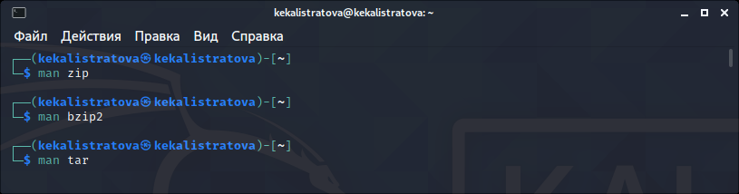{ #fig:001 width=70% }

Синтаксис команды zip для архивации файла (рис. -@fig:002):

zip[опции]  [имя  файла.zip][файлы  или  папки,которые  будем архивировать]

Синтаксис команды zip для разархивации/распаковки файла:

unzip[опции][файл_архива.zip][файлы]-x[исключить]-d[папка]

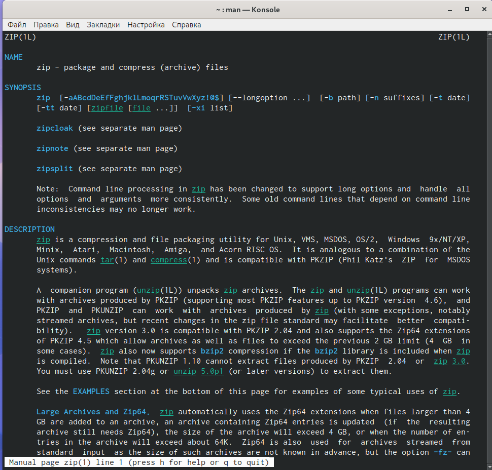{ #fig:002 width=70% }

Синтаксис команды bzip2 для архивации файла (рис. -@fig:003):

bzip2 [опции] [имена файлов]

Синтаксис команды bzip2 для разархивации/распаковки файла:

bunzip2[опции] [архивы.bz2]

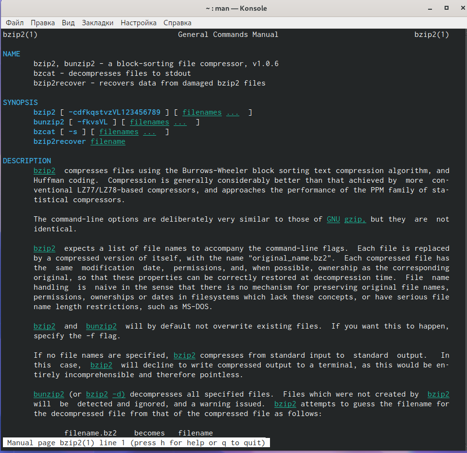{ #fig:003 width=70% }

Синтаксис команды tar для архивации файла (рис. -@fig:004):

tar[опции][архив.tar][файлы_для_архивации]

Синтаксис команды tar для разархивации/распаковки файла:

tar[опции][архив.tar]

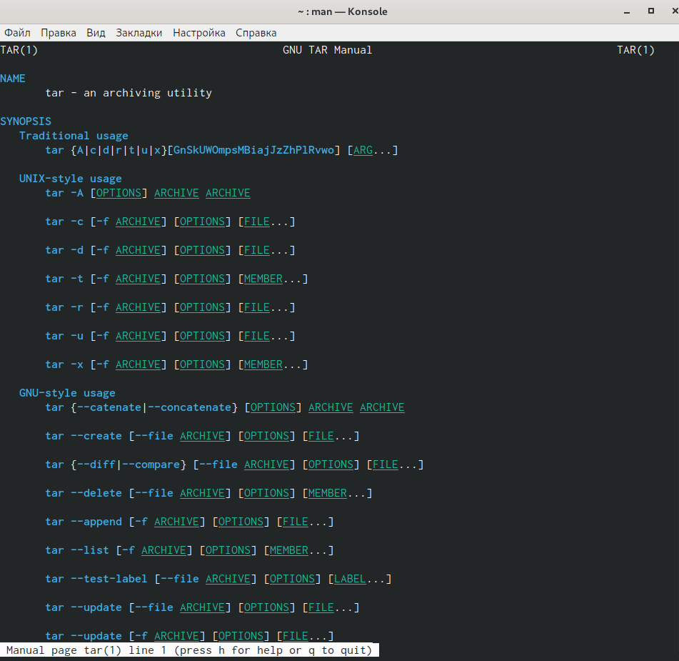{ #fig:004 width=70% }

Далее я создала файл, в котором буду писать первый скрипт, и открыла его в редакторе emacs, используя клавиши «Ctrl-x»и «Ctrl-f» (команды «touch backup.sh» и «emacs &»). (рис. -@fig:005) 

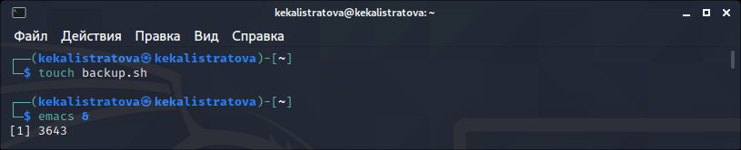{ #fig:005 width=70% }

После написала скрипт, который при запуске будет делать резервную копию самого себя (то есть файла, в котором содержится его исходный код)  в другую  директорию backup в  вашем  домашнем  каталоге.  При этом файл должен архивироваться одним из архиваторов на выбор zip, bzip2  или tar. При  написании  скрипта  использовала архиватор bzip2. (рис. -@fig:006) 

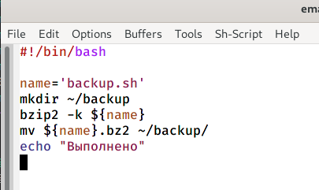{ #fig:006 width=70% }

Проверила  работу  скрипта(команда «./backup.sh»),  предварительно добавив  для  него  право  на  выполнение  (команда «chmod +x *.sh»). Проверила, появился ли каталог backup/, перейдя в него(команда «cd backup/»),  посмотрела  его  содержимое  (команда «ls») и  просмотрела содержимое архива (команда «bunzip2 -c backup.sh.bz2»). Скрипт работает корректно. (рис. -@fig:007) (рис. -@fig:008)

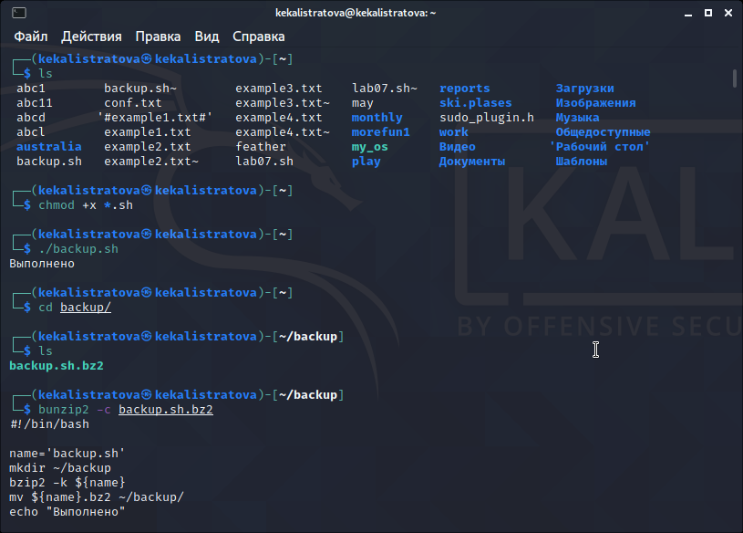{ #fig:007 width=70% } 

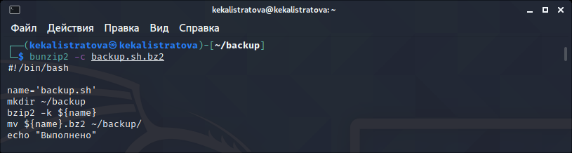{ #fig:008 width=70% }

2) Создала файл, в котором буду писать второй скрипт, и открыла его в редакторе emacs, используя клавиши «Ctrl-x» и «Ctrl-f» (команды «touchprog2.sh» и «emacs &»). (рис. -@fig:009)

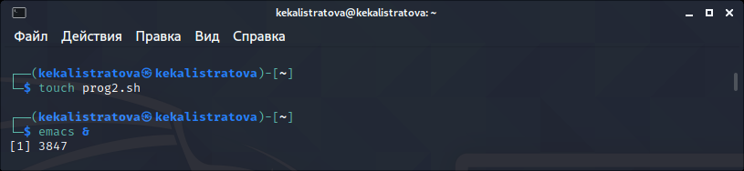{ #fig:009 width=70% }

Написала пример  командного  файла,  обрабатывающего  любое произвольное  число  аргументов  командной  строки,  в  том  числе превышающее  десять.  Например,  скрипт  может  последовательно распечатывать значения всех переданных аргументов. (рис. -@fig:010)
   
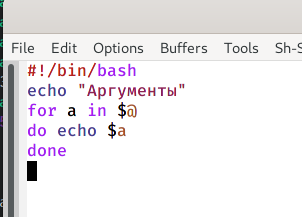{ #fig:010 width=70% } 
   
Проверила работу написанного скрипта (команды «./prog2.sh 0 1 2 3 4 5» и «./prog2.sh 0 1 2 3 4 5 6 7 8 9 10 11 12»), предварительно добавив для него право на выполнение (команда «chmod +x *.sh»). Вводила аргументы, количество которых меньше 10 и больше 10. Скрипт работает корректно. (рис. -@fig:011) (рис. -@fig:012)

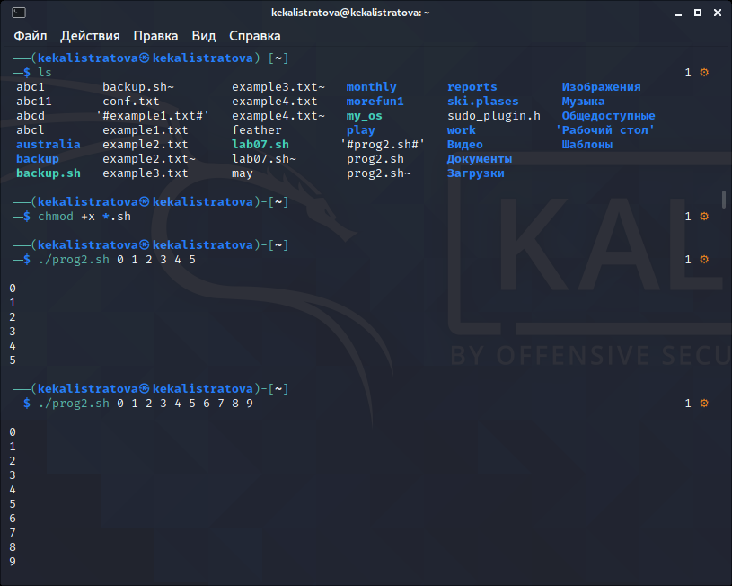{ #fig:011 width=70% } 

{ #fig:012 width=70% } 

3) Создала файл, в котором буду писать третий скрипт, и открыла его в редакторе emacs, используя клавиши «Ctrl-x» и «Ctrl-f» (команды «touch prls.sh» и «emacs &»)  (рис. -@fig:013) 

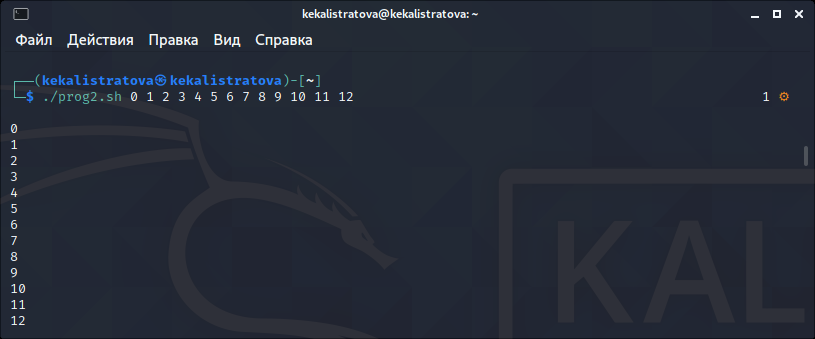{ #fig:013 width=70% } 

Написала  командный  файл−аналог  команды ls (без  использования самой этой команды и команды dir). Он должен выдавать информацию о нужном каталоге и выводить информацию о возможностях доступа к файлам этого каталога. (рис. -@fig:014)

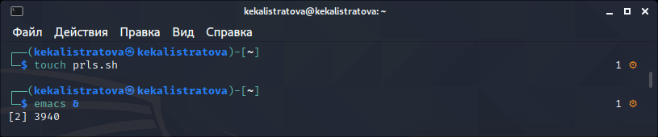{ #fig:014 width=70% } 

Далее   проверила   работу   скрипта (команда «./prls.sh~»), предварительно  добавив  для  него  право  на  выполнение  (команда «chmod +x *.sh»). Скрипт работает корректно. (рис. -@fig:015)

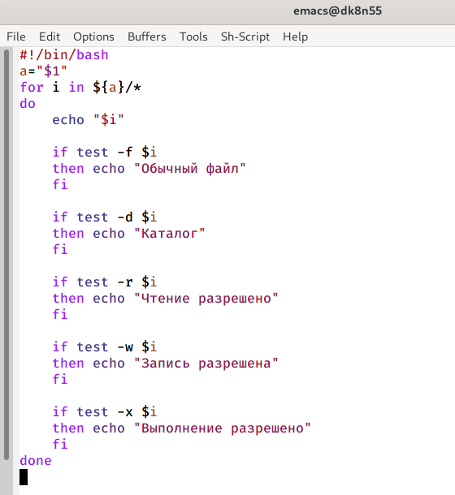{ #fig:015 width=70% }

4) Для четвертого скрипта также создала файл (команда «touch format.sh») и открыла его в редакторе emacs, используя клавиши «Ctrl-x» и «Ctrl-f» (команда «emacs &»). (рис. -@fig:016)

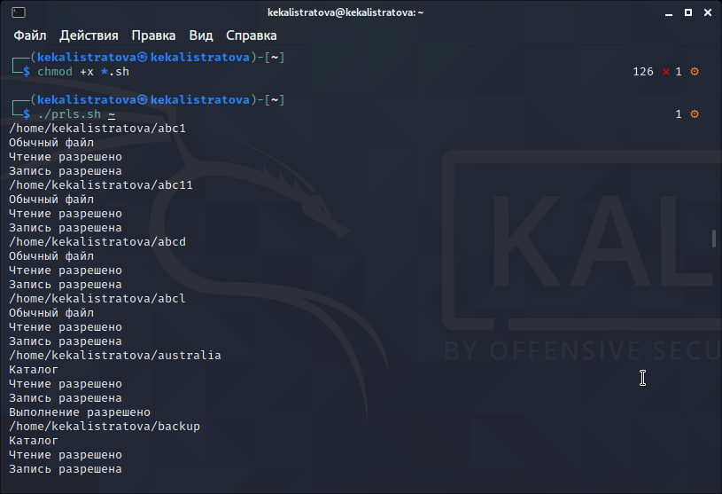{ #fig:016 width=70% } 

Написала командный  файл,  который  получает  в  качестве  аргумента командной строки формат файла (.txt, .doc, .jpg, .pdf и т.д.) и вычисляет количество таких файлов в указанной директории. Путь к директории также передаётся в виде аргумента командной строки. (рис. -@fig:017)

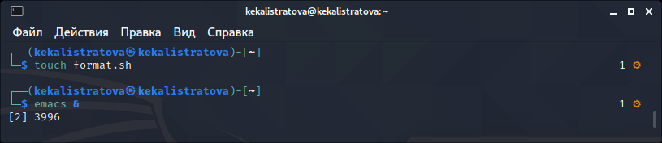{ #fig:017 width=70% }

Проверила работу написанного скрипта (команда «./format.sh ~ pdf jpg doc txt png»), предварительно добавив для него право на выполнение (команда «chmod +x *.sh»). Скрипт работает корректно. (рис. -@fig:018)

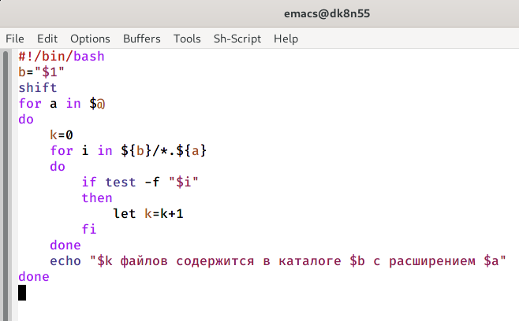{ #fig:018 width=70% }

# Контрольные вопросы

1). Командный  процессор  (командная  оболочка,  интерпретатор  команд shell) − это программа, позволяющая пользователю взаимодействовать с операционной системой компьютера. В операционных системах типа UNIX/Linux наиболее  часто  используются  следующие  реализации командных оболочек:

1. оболочка Борна (Bourneshellили sh) − стандартная командная оболочка UNIX/Linux, содержащая базовый, но при этом полный набор функций;

2. С-оболочка  (или csh) −надстройка  на  оболочкой  Борна, использующая  Сподобный  синтаксис  команд  с  возможностью сохранения истории выполнения команд;

3. Оболочка Корна (или ksh) − напоминает оболочку С, но операторы управления  программой  совместимы  с  операторами  оболочки Борна;

4. BASH − сокращение от BourneAgainShell(опять оболочка Борна), в  основе  своей  совмещает  свойства  оболочек  С  и  Корна (разработка компании FreeSoftwareFoundation).

2). POSIX (Portable Operating System Interface for Computer Environments ) − набор стандартов описания интерфейсов взаимодействия операционной системы и прикладных программ. Стандарты POSIX разработаны комитетом IEEE (Institute of Electricaland Electronics Engineers) для обеспечения совместимости различных UNIX/Linux подобных операционных систем и переносимости прикладных программ на уровне исходного кода. POSIX - совместимые оболочки разработаны на базе оболочки Корна.

3). Командный процессор bash обеспечивает возможность использования переменных  типа  строка  символов.  Имена  переменных  могут  быть выбраны пользователем. Пользователь имеет возможность присвоить переменной значение некоторой строки символов. Например, команда «mark=/usr/andy/bin» присваивает   значение   строки   символов /usr/andy/bin переменной mark типа строка символов. Значение,   присвоенное   некоторой   переменной, может быть впоследствии  использовано.  Для этого в соответствующем месте командной строки  должно  быть  употреблено  имя  этой  переменной, которому  предшествует  метасимвол  $.  Например,  команда «mvafile${mark}» переместит  файл afile из  текущего  каталога  в  каталог  с абсолютным полным именем /usr/andy/bin. Оболочка bash позволяет работать с массивами. Для создания массива используется  команда setс  флагом -A.  За  флагом  следует  имя переменной,  а  затем  список  значений,  разделённых  пробелами. Например, «set -Astates Delaware Michigan "New Jersey"». Далее можно сделать добавление в массив, например, states[49]=Alaska. Индексация массивов начинается с нулевого элемента.

4). Оболочка bash поддерживает  встроенные  арифметические  функции. Команда let является  показателем  того,  что  последующие  аргументы представляют собой выражение, подлежащее вычислению. Простейшее выражение − это единичный терм (term), обычно целочисленный. Команда let берет два операнда и присваивает их переменной. Команда read позволяет читать значения переменных со стандартного ввода: «echo "Please enter Month and Day of Birth ?"» «read mon day trash». В  переменные monи day будут  считаны  соответствующие  значения, введённые  с  клавиатуры,  а  переменная trash нужна  для  того,  чтобы отобрать всю избыточно введённую информацию и игнорировать её.

5). В языке программирования bash можно применять такие арифметические операции как сложение (+), вычитание (-), умножение (*), целочисленное деление (/) и целочисленный остаток от деления (%).

6). В (( ))можно  записывать условия  оболочки bash, а также внутри двойных  скобок  можно  вычислять  арифметические  выражения  и возвращать результат.

7). Стандартные переменные:

1. PATH: значением данной переменной является список каталогов, в которых командный процессор осуществляет поиск программы или команды, указанной в командной строке, в том случае, если указанное имя программы или команды не содержит ни одного символа /. Если имя команды содержит хотя бы один символ /, то последовательность   поиска,   предписываемая   значением переменной PATH, нарушается. В этом случае в зависимости от того,  является  имя  команды  абсолютным  или  относительным, поиск  начинается  соответственно  от  корневогоили  текущего каталога.

2. PS1  и PS2: эти  переменные  предназначены  для  отображения промптера  командного  процессора. PS1  −  это  промптер командного  процессора,  по  умолчанию  его  значение  равно символу  $  или  #.  Если  какая-то  интерактивная  программа, запущенная   командным  процессором,   требует   ввода,   то используется  промптер PS2. Он  по  умолчанию  имеет  значение символа >.

3. HOME: имя домашнего каталога пользователя. Если команда cdвводится  без  аргументов,  то  происходит  переход  в  каталог,указанный в этой переменной.

4. IFS:последовательность символов, являющихся разделителями в командной строке, например, пробел, табуляция и перевод строки (newline).

5. MAIL:командный процессор каждый раз перед выводом на экран промптера проверяет содержимое файла, имя которого указано в этой переменной, и если содержимое этого файла изменилось с момента последнего ввода из него, то перед тем как вывести на терминал промптер, командный процессор выводит на терминал сообщение Youhavemail(у Вас есть почта).

6. TERM: тип используемого терминала.

7. LOGNAME: содержит  регистрационное  имя  пользователя, которое устанавливается автоматически при входе в систему.

8). Такие символы, как ' < > * ? | \" &, являются метасимволами и имеют для командного процессора специальный смысл.

9). Снятие специального смысла с метасимвола называется экранированием мета символа. Экранирование может быть осуществлено с помощью предшествующего мета символу символа \, который, в свою очередь, является мета символом. Для  экранирования  группы  метасимволов  нужно  заключить  её  в одинарные  кавычки.  Строка,  заключённая  в  двойные  кавычки, экранирует все метасимволы, кроме $, ' , \, ". Например, –echo\* выведет на экран символ *, –echoab’*\|*’cd выведет на экран строку ab*\|*cd.

10). Последовательность команд может быть помещена в текстовый файл. Такой файл называется командным. Далее этот файл можно выполнить по команде: «bash командный_файл [аргументы]». Чтобы  не  вводить  каждый  раз  последовательности символов bash, необходимо изменить код защиты этого командного файла, обеспечив доступ  к этому  файлу  по  выполнению.  Это  может  быть  сделано  с помощью команды «chmod +x имя_файла». Теперь можно вызывать свой командный файл на выполнение, просто вводя  его  имя  с  терминала  так, как  будтоон  является  выполняемой программой. Командный процессор распознает, что в Вашем файле на самом  деле  хранится  не  выполняемая  программа, а программа, написанная на языке программирования  оболочки, и осуществить её интерпретацию.

11). Группу команд можно объединить в функцию. Для этого существует ключевое слово function, после которого следует имя функции и список команд, заключённых в фигурные скобки. Удалить функцию можно с помощью команды unsetcфлагом -f.

12). Чтобы выяснить, является ли файл каталогом или обычным файлом, необходимо воспользоваться командами «test-f [путь до файла]» (для проверки, является ли обычным файлом) и «test -d[путь до файла]» (для проверки, является ли каталогом).

13). Команду «set» можно использовать для вывода списка переменных окружения. В системах Ubuntu и Debia nкоманда «set» также выведет список функций  командной  оболочки  после  списка  переменных командной оболочки. Поэтому для ознакомления со всеми элементами списка  переменных  окружения  при  работе  с  данными  системами рекомендуется использовать команду «set| more». Команда «typeset» предназначена для  наложения  ограничений  на переменные. Команду «unset» следует использовать для удаления переменной из окружения командной оболочки.

14). При вызове командного файла на выполнение параметры ему могут быть переданы точно таким же образом, как и выполняемой программе. С  точки  зрения  командного  файла  эти  параметры  являются позиционными.  Символ  $  является  метасимволом  командного процессора. Он используется, в частности, для ссылки на параметры, точнее, для получения их значений в командном файле. В командный файл можно передать до девяти параметров. При использовании где-либо в командном файле комбинации символов $i, где 0 < i< 10, вместо неё будет осуществлена подстановка значения параметра с порядковым номером i, т.е. аргумента командного файла с порядковым номером i. Использование  комбинации  символов  $0  приводит  к  подстановке вместо неё имени данного командного файла.

15). Специальные переменные:

1. $* −отображается вся командная строка или параметры оболочки;

2. $? −код завершения последней выполненной команды;

3. $$ −уникальный  идентификатор  процесса,  в  рамках  которого выполняется командный процессор;

4. $! −номер процесса, в рамках которого выполняется последняя вызванная на выполнение в командном режиме команда;

5. $-−значение флагов командного процессора;

6. ${#*} −возвращает целое число −количествослов, которые были результатом $*;

7. ${#name} −возвращает  целое  значение  длины  строки  в переменной name;

8. ${name[n]} −обращение к n-му элементу массива;

9. ${name[*]}−перечисляет  все  элементы  массива,  разделённые пробелом;

10. ${name[@]}−то  же  самое,  но  позволяет  учитывать  символы пробелы в самих переменных;

11. ${name:-value} −если значение переменной name не определено, то оно будет заменено на указанное value;

12. ${name:value} −проверяется факт существования переменной;

13. ${name=value} −если name не определено, то ему присваивается значение value;

14. ${name?value} −останавливает   выполнение,   если   имя переменной  не  определено,  и  выводит value как  сообщение об ошибке;

15. ${name+value} −это  выражение  работает  противоположно ${name-value}. Если переменная  определена,  то  подставляется value;

16. ${name#pattern} −представляет  значение  переменной name с удалённым самым коротким левым образцом (pattern);

17. ${#name[*]} и ${#name[@]}−эти  выражения  возвращают количество элементов в массиве name.

# Выводы

В ходе выполнения данной лабораторной работы я изучила основы программирования  в  оболочке  ОС UNIX/Linux и  научилась писать небольшие командные файлы.

# Библиография

1. https://esystem.rudn.ru/pluginfile.php/1142090/mod_resource/content/2/008-lab_shell_prog_1.pdf

2. Кулябов Д.С. Операционные системы: лабораторные работы: учебное пособие / Д.С. Кулябов, М.Н. Геворкян, А.В. Королькова, А.В. Демидова. — М. : Изд-во РУДН, 2016. — 117 с. — ISBN 978-5-209-07626-1 : 139.13; То же [Электронный ресурс]. — URL: http://lib.rudn.ru/MegaPro2/Download/MObject/6118.

3. Робачевский А.М. Операционная система UNIХ [текст] : Учебное пособие / А.М. Робачевский, С.А. Немнюгин, О.Л. Стесик. — 2-е изд., перераб. и доп. — СПб. : БХВ-Петербург, 2005, 2010. — 656 с. : ил. — ISBN 5-94157-538-6 : 164.56. (ЕТ 60)

4. Таненбаум Эндрю. Современные операционные системы [Текст] / Э. Таненбаум. — 2-е изд. — СПб. : Питер, 2006. — 1038 с. : ил. — (Классика Computer Science). — ISBN 5-318-00299-4 : 446.05. (ЕТ 50)
