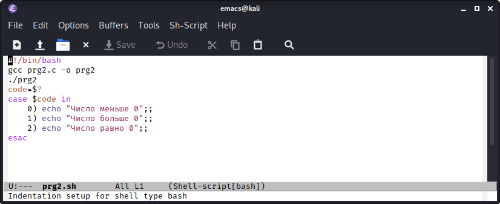
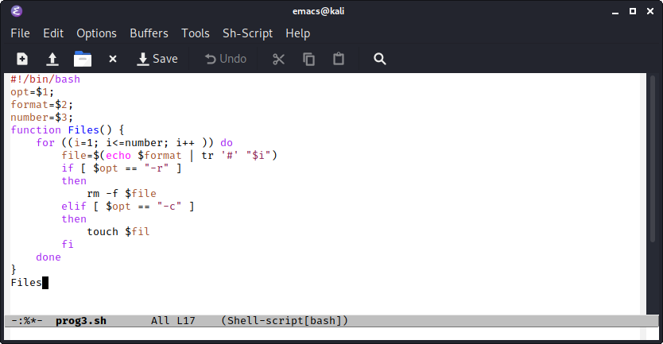
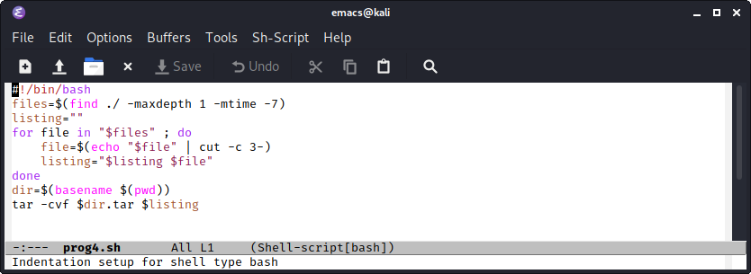

---
## Front matter
lang: ru-RU
title: Structural approach to the deep learning method
author: Калистратова Ксения Евгеньевна
institute: RUDN
date: 29.05.2021

## Formatting
toc: false
slide_level: 2
theme: metropolis
header-includes: 
 - \metroset{progressbar=frametitle,sectionpage=progressbar,numbering=fraction}
 - '\makeatletter'
 - '\beamer@ignorenonframefalse'
 - '\makeatother'
aspectratio: 43
section-titles: true
---

## Цель работы

Изучить основы программирования в оболочке ОС UNIX. Научится  писать  более  сложные командные  файлы  с  использованием логических управляющих конструкций и циклов.

## Задачи

1. Познакомиться с логическими управляющими конструкций и циклов.
2. В ходе работы написать 4 командных файла.
3. Выполнить отчет.

## Выполнение лабораторной работы

Предварительно для командных файлов создаем файл и открываем emacs. Первый скрипт анализирует командную строку с ключами, используя команду getopts grep. Второй командный файл должен вызывать предварительно написанную на языке Си программу, которая выводит число и опредляет его равенство или неравенство с нулем. (рис. -@fig:001) 

{ #fig:001 width=70% }

## Выполнение лабораторной работы

Третий командный файл создает указанное число файлов, пронумерованных от 1 до n. Также он умеет удалять все созданные им файлы. (рис. -@fig:002)

{ #fig:002 width=70% }

## Выполнение лабораторной работы

Четвертый командный файл с помощью команды tar запаковывает в архив все файлы в указанной директории. Он также модифицирован таким образом, чтобы запаковывались только те файлы, которые были изменены менее неделю тому назад. (рис. -@fig:003)

{ #fig:003 width=70% }

## Вывод

В  ходе  выполнения  данной  лабораторной  работы  я  изучила основы программирования в оболочке ОС UNIX и научилась писать более сложные командные файлы с использованием логических управляющих конструкций и циклов.
