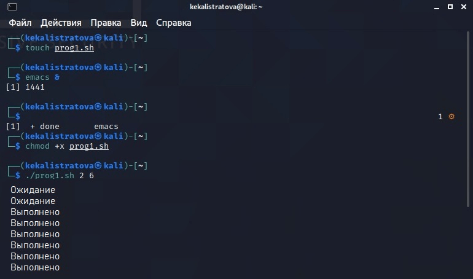
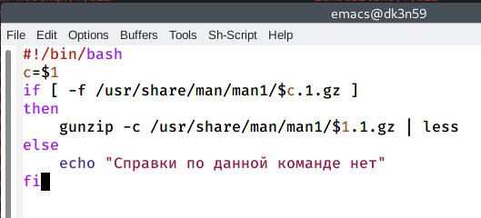
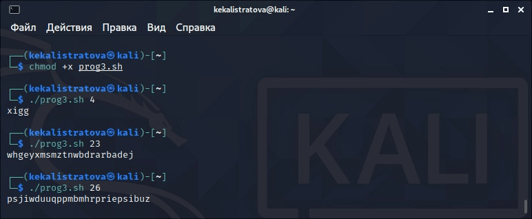

---
## Front matter
lang: ru-RU
title: Лабораторная работа №13
author: |
	Калстратова Ксения Евгеньевна\inst{1}
institute: |
	\inst{1}RUDN University, Moscow, Russian Federation
date: 26 мая, 2021, Москва, Россия

## Formatting
toc: false
slide_level: 2
theme: metropolis
header-includes: 
 - \metroset{progressbar=frametitle,sectionpage=progressbar,numbering=fraction}
 - '\makeatletter'
 - '\beamer@ignorenonframefalse'
 - '\makeatother'
aspectratio: 43
section-titles: true
---

## Цель работы

Изучить основы программирования в оболочке ОС UNIX. Научится  писать  более  сложные командные  файлы  с  использованием логических управляющих конструкций и циклов.

## Задачи

1. Познакомиться с логическими управляющими конструкций и циклов.
2. В ходе работы написать 3 командных файла.
3. Выполнить отчет.

## Выполнение лабораторной работы

Предварительно для командных файлов создаем файл и открываем emacs. Первый скрипт реализует упрощенный механизм семафора. (рис. -@fig:001) 

{ #fig:001 width=70% }

## Выполнение лабораторной работы

Второй командный файл реализовывал команду man. Мы предварительно изучили содержимое каталога /usr/share/man/man1. Командный файл должен в виде результата выдавать справку об этой команде или сообщение об отсутствии справки. (рис. -@fig:002)

{ #fig:002 width=70% }

## Выполнение лабораторной работы

Третий командный файл, используя встроенную переменную $RANDOM, генерирует случайную последовательность латинских букв. (рис. -@fig:003)

{ #fig:003 width=70% }

## Вывод

В  ходе  выполнения  данной  лабораторной  работы  я  изучила основы программирования в оболочке ОС UNIX и научилась писать более сложные командные файлы с использованием логических управляющих конструкций и циклов.

